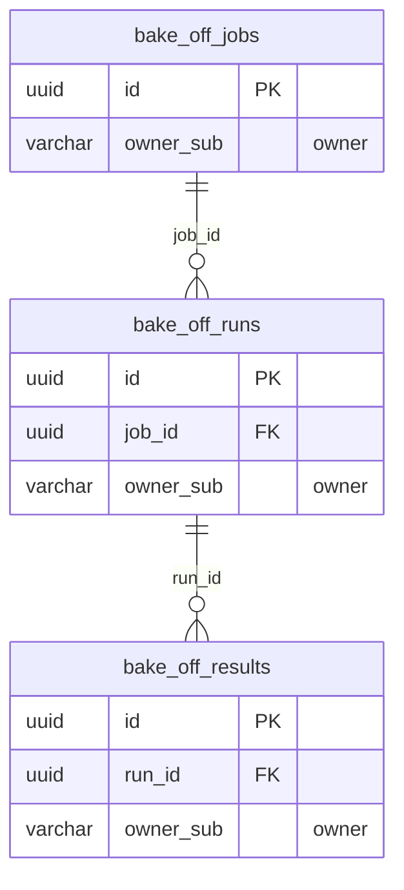

<!-- GENERATED by scripts/generate-schema-docs.js - do not edit by hand; regenerate instead. -->

# AI Bake-Off (`bake-off`) - database schema

Postgres database `oshal`, schema `public` - shared with the platform and every other installed package. 3 tables in the reference database.

**Migrations** (declared in `oshal-app.yaml`, applied on activation, recorded in `app_package_migrations`): `migrations/001-bake-off.sql`

**Created at runtime by package code** (`CREATE TABLE IF NOT EXISTS`): `routes/bake-off-store.js`, `src-routes/bake-off-store.ts`

Platform conventions (ownership, RLS, how migrations run): [core data model](https://github.com/emeraldcoastsystemsgroup/oshal/blob/main/docs/architecture/data-model/README.md).

The diagram shows key columns only: primary keys (PK), foreign keys (FK), single-column unique keys (UK) and the column an RLS policy scopes rows by ("owner"). A box with no columns is a table documented on another page. Every column is listed under Tables.

## Diagram

## Tables

### `bake_off_jobs`

Defined in `migrations/001-bake-off.sql`, `routes/bake-off-store.js`, `src-routes/bake-off-store.ts` · RLS **forced** - owner `owner_sub`

| Column | Type | Null | Default | Notes |
|---|---|---|---|---|
| `id` | uuid | no | gen_random_uuid() | PK |
| `owner_sub` | character varying(255) | no |  | owner |
| `name` | text | no |  |  |
| `prompt` | text | no |  |  |
| `rubric` | jsonb | no | '[]' |  |
| `reference` | text | yes |  |  |
| `quality_bar` | numeric(5,2) | no | 70 |  |
| `monthly_volume` | integer | no | 100 |  |
| `lane_agent_ids` | jsonb | no | '[]' |  |
| `created_at` | timestamp with time zone | no | now() |  |
| `updated_at` | timestamp with time zone | no | now() |  |

### `bake_off_results`

Defined in `migrations/001-bake-off.sql`, `routes/bake-off-store.js`, `src-routes/bake-off-store.ts` · RLS **forced** - owner `owner_sub`

| Column | Type | Null | Default | Notes |
|---|---|---|---|---|
| `id` | uuid | no | gen_random_uuid() | PK |
| `run_id` | uuid | no |  | FK → [`bake_off_runs.id`](#bake_off_runs) |
| `owner_sub` | character varying(255) | no |  | owner |
| `lane_bot` | text | no |  |  |
| `lane_agent_id` | character varying(64) | no |  |  |
| `lane_harness` | text | no |  |  |
| `lane_provider` | text | no |  |  |
| `observed_model` | text | yes |  |  |
| `ok` | boolean | no | false |  |
| `output` | text | yes |  |  |
| `cost_usd` | numeric(12,6) | yes |  |  |
| `total_tokens` | integer | yes |  |  |
| `duration_ms` | integer | yes |  |  |
| `judge_score` | numeric(5,2) | yes |  |  |
| `judge_mode` | character varying(32) | yes |  |  |
| `judge_rationale` | text | yes |  |  |
| `dimensions` | jsonb | yes |  |  |
| `task_id` | character varying(64) | yes |  |  |
| `error` | text | yes |  |  |
| `created_at` | timestamp with time zone | no | now() |  |

### `bake_off_runs`

Defined in `migrations/001-bake-off.sql`, `routes/bake-off-store.js`, `src-routes/bake-off-store.ts` · RLS **forced** - owner `owner_sub`

| Column | Type | Null | Default | Notes |
|---|---|---|---|---|
| `id` | uuid | no | gen_random_uuid() | PK |
| `job_id` | uuid | no |  | FK → [`bake_off_jobs.id`](#bake_off_jobs) |
| `owner_sub` | character varying(255) | no |  | owner |
| `status` | character varying(16) | no | 'running' |  |
| `lanes_requested` | integer | no | 0 |  |
| `lanes_completed` | integer | no | 0 |  |
| `error` | text | yes |  |  |
| `started_at` | timestamp with time zone | no | now() |  |
| `finished_at` | timestamp with time zone | yes |  |  |
