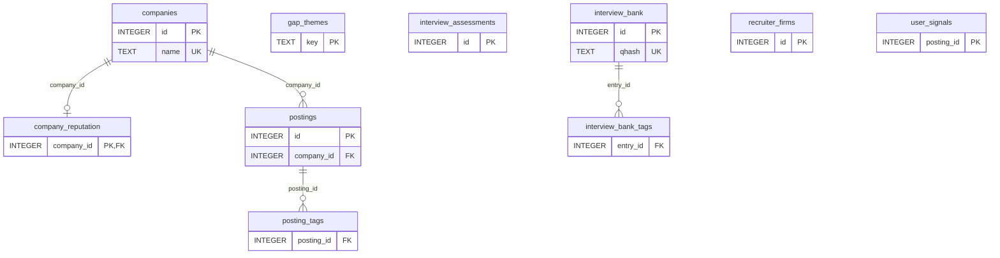

<!-- GENERATED by scripts/generate-schema-docs.js - do not edit by hand; regenerate instead. -->

# Intelligent Career (`career-hunter`) - database schema

Postgres database `oshal`, schema `public` - shared with the platform and every other installed package. 17 tables and 10 views in the reference database, 10 SQLite tables.

**Migrations** (declared in `oshal-app.yaml`, applied on activation, recorded in `app_package_migrations`): `migrations/031-career-hunter.sql`, `migrations/077-career-digest.sql`, `migrations/082-career-title-profile.sql`, `migrations/090-career-rls.sql`, `migrations/091-career-automation.sql`, `migrations/100-career-user-targets.sql`, `migrations/104-career-remote-only.sql`, `migrations/095-career-corpus.sql`, `migrations/096-career-corpus-complete.sql`, `migrations/097-career-postings-view.sql`, `migrations/098-career-peruser-views.sql`, `migrations/099-career-interview-bank.sql`, `migrations/100-career-application-provenance.sql`, `migrations/101-career-apply-claim-lease.sql`, `migrations/102-career-apply-run-binding.sql`, `migrations/103-career-interview-source-identity.sql`

Platform conventions (ownership, RLS, how migrations run): [core data model](https://github.com/emeraldcoastsystemsgroup/oshal/blob/main/docs/architecture/data-model/README.md).

The diagram shows key columns only: primary keys (PK), foreign keys (FK), single-column unique keys (UK) and the column an RLS policy scopes rows by ("owner"). A box with no columns is a table documented on another page. Every column is listed under Tables.

## Diagram

```mermaid
erDiagram
  career_automation_settings {
    text user_sub PK "owner"
  }
  career_companies {
    bigint id PK
    text name UK
  }
  career_company_reputation {
    bigint company_id PK, FK
  }
  career_digest_settings {
    varchar user_sub PK "owner"
  }
  career_hunter_applications {
    uuid id PK
    text user_sub "owner"
  }
  career_hunter_tenants {
    text tenant_id PK
  }
  career_interview_bank {
    bigint id PK
    text qhash UK
  }
  career_interview_bank_tags {
    bigint entry_id FK
  }
  career_posting_tags {
    bigint posting_id FK
  }
  career_postings {
    bigint id PK
    bigint company_id FK
  }
  career_score_settings {
    varchar user_sub PK "owner"
  }
  career_user_applications {
    varchar user_sub PK "owner"
    bigint posting_id PK, FK
  }
  career_user_gap_themes {
    varchar user_sub PK "owner"
    text key PK
  }
  career_user_interview_assessments {
    bigint id PK
    varchar user_sub "owner"
  }
  career_user_job_scores {
    varchar user_sub PK "owner"
    bigint posting_id PK, FK
  }
  career_user_recruiter_firms {
    varchar user_sub PK "owner"
    bigint id PK
  }
  career_user_targets {
    bigint id PK
    text user_sub "owner"
  }
  career_companies ||--o| career_company_reputation : "company_id"
  career_interview_bank ||--o{ career_interview_bank_tags : "entry_id"
  career_postings ||--o{ career_posting_tags : "posting_id"
  career_companies ||--o{ career_postings : "company_id"
  career_postings ||--o{ career_user_applications : "posting_id"
  career_postings ||--o{ career_user_job_scores : "posting_id"
```

## Tables

### `career_automation_settings`

Defined in `migrations/091-career-automation.sql` · RLS **forced** - owner `user_sub`

| Column | Type | Null | Default | Notes |
|---|---|---|---|---|
| `user_sub` | text | no |  | PK · owner |
| `auto_generate` | boolean | no | false |  |
| `auto_submit` | boolean | no | false |  |
| `updated_at` | timestamp with time zone | no | now() |  |

### `career_companies`

Defined in `migrations/095-career-corpus.sql` · RLS **off**

| Column | Type | Null | Default | Notes |
|---|---|---|---|---|
| `id` | bigint | no | nextval('career_companies_id_seq') | PK |
| `name` | text | no |  | UK |
| `ticker` | text | yes |  |  |
| `domain` | text | yes |  |  |
| `homepage` | text | yes |  |  |
| `careers_url` | text | yes |  |  |
| `ats_type` | text | yes |  |  |
| `ats_token` | text | yes |  |  |
| `industry` | text | yes |  |  |
| `source_lists` | jsonb | yes |  |  |
| `last_scraped_at` | timestamp with time zone | yes |  |  |
| `created_at` | timestamp with time zone | no | now() |  |
| `updated_at` | timestamp with time zone | no | now() |  |
| `hq` | text | yes |  |  |
| `discover_status` | text | yes |  |  |
| `gsearched` | boolean | yes |  |  |
| `referral` | integer | no | 0 |  |

### `career_company_reputation`

Defined in `migrations/096-career-corpus-complete.sql` · RLS **off**

| Column | Type | Null | Default | Notes |
|---|---|---|---|---|
| `company_id` | bigint | no |  | PK · FK → [`career_companies.id`](#career_companies) |
| `ai_score` | integer | yes |  |  |
| `ai_about` | text | yes |  |  |
| `ai_positives` | text | yes |  |  |
| `ai_negatives` | text | yes |  |  |
| `ai_rated_at` | timestamp with time zone | yes |  |  |
| `manual_score` | integer | yes |  |  |
| `manual_about` | text | yes |  |  |
| `manual_positives` | text | yes |  |  |
| `manual_negatives` | text | yes |  |  |
| `manual_note` | text | yes |  |  |
| `updated_at` | timestamp with time zone | no | now() |  |

### `career_digest_settings`

Defined in `migrations/077-career-digest.sql` · RLS **forced** - owner `user_sub`

| Column | Type | Null | Default | Notes |
|---|---|---|---|---|
| `user_sub` | character varying(255) | no |  | PK · owner |
| `digest_enabled` | boolean | no | true |  |
| `last_digest_at` | timestamp with time zone | yes |  |  |
| `notify_channel` | character varying(16) | yes |  |  |
| `notify_phone` | text | yes |  |  |
| `created_at` | timestamp with time zone | no | now() |  |
| `updated_at` | timestamp with time zone | no | now() |  |

### `career_hunter_applications`

Defined in `migrations/031-career-hunter.sql` · RLS **forced** - owner `user_sub`; `oshal_is_tenant_member(tenant_id)`

| Column | Type | Null | Default | Notes |
|---|---|---|---|---|
| `id` | uuid | no | gen_random_uuid() | PK |
| `tenant_id` | text | no | 'default' |  |
| `user_sub` | text | no |  | owner |
| `ticket_id` | uuid | yes |  |  |
| `posting_id` | integer | no |  |  |
| `company` | text | yes |  |  |
| `title` | text | yes |  |  |
| `include_oshal` | boolean | no | false |  |
| `status` | text | no | 'approval_required' |  |
| `created_at` | timestamp with time zone | no | now() |  |
| `updated_at` | timestamp with time zone | no | now() |  |
| `application_source` | text | yes |  |  |
| `application_task_id` | text | yes |  |  |

### `career_hunter_tenants`

Defined in `migrations/031-career-hunter.sql` · RLS **forced** - `oshal_is_tenant_member(tenant_id)`

| Column | Type | Null | Default | Notes |
|---|---|---|---|---|
| `tenant_id` | text | no |  | PK |
| `label` | text | yes |  |  |
| `created_at` | timestamp with time zone | no | now() |  |

### `career_interview_bank`

Defined in `migrations/099-career-interview-bank.sql` · RLS **off**

| Column | Type | Null | Default | Notes |
|---|---|---|---|---|
| `id` | bigint | no | nextval('career_interview_bank_id_seq') | PK |
| `category` | text | yes |  |  |
| `question` | text | no |  |  |
| `good` | text | yes |  |  |
| `red_flag` | text | yes |  |  |
| `source_dim` | text | yes |  |  |
| `qhash` | text | yes |  | UK |
| `created_at` | timestamp with time zone | no | now() |  |

### `career_interview_bank_tags`

Defined in `migrations/099-career-interview-bank.sql` · RLS **off**

| Column | Type | Null | Default | Notes |
|---|---|---|---|---|
| `entry_id` | bigint | no |  | FK → [`career_interview_bank.id`](#career_interview_bank) |
| `dim` | text | no |  |  |
| `tag` | text | no |  |  |

### `career_posting_tags`

Defined in `migrations/099-career-interview-bank.sql` · RLS **off**

| Column | Type | Null | Default | Notes |
|---|---|---|---|---|
| `posting_id` | bigint | no |  | FK → [`career_postings.id`](#career_postings) |
| `dim` | text | no |  |  |
| `tag` | text | no |  |  |

### `career_postings`

Defined in `migrations/095-career-corpus.sql` · RLS **off**

| Column | Type | Null | Default | Notes |
|---|---|---|---|---|
| `id` | bigint | no | nextval('career_postings_id_seq') | PK |
| `company_id` | bigint | no |  | FK → [`career_companies.id`](#career_companies) |
| `ats_job_id` | text | no |  |  |
| `title` | text | no |  |  |
| `description` | text | yes |  |  |
| `url` | text | yes |  |  |
| `location` | text | yes |  |  |
| `city` | text | yes |  |  |
| `state` | text | yes |  |  |
| `lat` | double precision | yes |  |  |
| `lon` | double precision | yes |  |  |
| `remote` | boolean | yes |  |  |
| `department` | text | yes |  |  |
| `job_type` | text | yes |  |  |
| `salary_min` | numeric | yes |  |  |
| `salary_max` | numeric | yes |  |  |
| `salary_currency` | text | yes |  |  |
| `salary_period` | text | yes |  |  |
| `salary_raw` | text | yes |  |  |
| `salary_source` | text | yes |  |  |
| `posted_at` | timestamp with time zone | yes |  |  |
| `posted_date` | date | yes |  |  |
| `first_seen_at` | timestamp with time zone | no | now() |  |
| `last_seen_at` | timestamp with time zone | no | now() |  |
| `active` | boolean | no | true |  |

### `career_score_settings`

Defined in `migrations/082-career-title-profile.sql` · RLS **forced** - owner `user_sub`

| Column | Type | Null | Default | Notes |
|---|---|---|---|---|
| `user_sub` | character varying(255) | no |  | PK · owner |
| `title_terms` | text[] | no | '{}' |  |
| `title_terms_source` | character varying(16) | no | 'unset' |  |
| `last_title_pass_at` | timestamp with time zone | yes |  |  |
| `last_cron_score_at` | timestamp with time zone | yes |  |  |
| `created_at` | timestamp with time zone | no | now() |  |
| `updated_at` | timestamp with time zone | no | now() |  |
| `remote_only` | boolean | no | false | When true, the automated match considers only postings whose corpus `remote` flag is set: the scoring candidate query, the digest, and the matched board. The Job Search screen keeps its own explicit Any/Remote/On-site pills and is deliberately NOT overridden by this. |

### `career_user_applications`

Defined in `migrations/095-career-corpus.sql` · RLS **forced** - owner `user_sub`

| Column | Type | Null | Default | Notes |
|---|---|---|---|---|
| `user_sub` | character varying(255) | no |  | PK · owner |
| `posting_id` | bigint | no |  | PK · FK → [`career_postings.id`](#career_postings) |
| `tenant_id` | text | no | 'default' |  |
| `status` | text | no | 'new' |  |
| `resume_path` | text | yes |  |  |
| `cover_path` | text | yes |  |  |
| `promoted_at` | timestamp with time zone | yes |  |  |
| `generated_at` | timestamp with time zone | yes |  |  |
| `outreach_sent_at` | timestamp with time zone | yes |  |  |
| `applied_at` | timestamp with time zone | yes |  |  |
| `interview_at` | timestamp with time zone | yes |  |  |
| `offer_at` | timestamp with time zone | yes |  |  |
| `closed_at` | timestamp with time zone | yes |  |  |
| `outcome` | text | yes |  |  |
| `notes` | text | yes |  |  |
| `created_at` | timestamp with time zone | no | now() |  |
| `updated_at` | timestamp with time zone | no | now() |  |
| `apply_active` | integer | no | 1 |  |
| `confirmation_path` | text | yes |  |  |
| `application_source` | text | yes |  |  |
| `application_task_id` | text | yes |  |  |
| `apply_claimed_at` | bigint | yes |  | Epoch milliseconds when apply_active changed to 0; NULL means unclaimed or a legacy claim. |
| `apply_run_id` | uuid | yes |  | Authoritative core apply_runs.run_id; retained after settlement for exact correlation. |
| `apply_claim_token` | uuid | yes |  | One-time release/settlement CAS token; cleared only by the matching Apply run. |

### `career_user_gap_themes`

Defined in `migrations/096-career-corpus-complete.sql` · RLS **forced** - owner `user_sub`

| Column | Type | Null | Default | Notes |
|---|---|---|---|---|
| `user_sub` | character varying(255) | no |  | PK · owner |
| `key` | text | no |  | PK |
| `tenant_id` | text | no | 'default' |  |
| `n_jobs` | integer | yes |  |  |
| `avg_fit` | integer | yes |  |  |
| `sample_gaps` | text | yes |  |  |
| `status` | text | yes |  |  |
| `response` | text | yes |  |  |
| `answered_at` | timestamp with time zone | yes |  |  |
| `updated_at` | timestamp with time zone | no | now() |  |

### `career_user_interview_assessments`

Defined in `migrations/096-career-corpus-complete.sql` · RLS **forced** - owner `user_sub`

| Column | Type | Null | Default | Notes |
|---|---|---|---|---|
| `id` | bigint | no | nextval('career_user_interview_assessments_id_seq') | PK |
| `user_sub` | character varying(255) | no |  | owner |
| `tenant_id` | text | no | 'default' |  |
| `at` | timestamp with time zone | yes |  |  |
| `company` | text | yes |  |  |
| `role` | text | yes |  |  |
| `transcript` | text | yes |  |  |
| `answers` | text | yes |  |  |
| `result` | text | yes |  |  |
| `finalized` | integer | no | 0 |  |
| `source_id` | bigint | yes |  | Exact interview_assessments.id from the SQLite source; NULL marks a pre-103 unmapped load. |

### `career_user_job_scores`

Defined in `migrations/095-career-corpus.sql` · RLS **forced** - owner `user_sub`

| Column | Type | Null | Default | Notes |
|---|---|---|---|---|
| `user_sub` | character varying(255) | no |  | PK · owner |
| `posting_id` | bigint | no |  | PK · FK → [`career_postings.id`](#career_postings) |
| `tenant_id` | text | no | 'default' |  |
| `fit_score` | integer | yes |  |  |
| `target_role` | boolean | no | false |  |
| `ai_fit_score` | integer | yes |  |  |
| `ai_fit_rationale` | text | yes |  |  |
| `ai_fit_matched` | jsonb | yes |  |  |
| `ai_fit_gaps` | jsonb | yes |  |  |
| `ai_model` | text | yes |  |  |
| `ai_scored_at` | timestamp with time zone | yes |  |  |
| `scored_at` | timestamp with time zone | no | now() |  |

### `career_user_recruiter_firms`

Defined in `migrations/096-career-corpus-complete.sql` · RLS **forced** - owner `user_sub`

| Column | Type | Null | Default | Notes |
|---|---|---|---|---|
| `user_sub` | character varying(255) | no |  | PK · owner |
| `id` | bigint | no |  | PK |
| `tenant_id` | text | no | 'default' |  |
| `firm` | text | no |  |  |
| `bucket` | text | yes |  |  |
| `website` | text | yes |  |  |
| `contact_name` | text | yes |  |  |
| `contact_role` | text | yes |  |  |
| `contact_link` | text | yes |  |  |
| `resume_label` | text | yes |  |  |
| `channel` | text | yes |  |  |
| `status` | text | yes |  |  |
| `date_contacted` | text | yes |  |  |
| `followup_date` | text | yes |  |  |
| `next_action` | text | yes |  |  |
| `notes` | text | yes |  |  |
| `sort_order` | integer | yes |  |  |
| `updated_at` | timestamp with time zone | no | now() |  |

### `career_user_targets`

Defined in `migrations/100-career-user-targets.sql` · RLS **forced** - owner `user_sub`

| Column | Type | Null | Default | Notes |
|---|---|---|---|---|
| `id` | bigint | no | nextval('career_user_targets_id_seq') | PK |
| `user_sub` | text | no |  | owner |
| `url` | text | no |  |  |
| `ats_type` | text | no |  |  |
| `ats_token` | text | yes |  |  |
| `status` | text | no | 'accepted' |  |
| `company_id` | bigint | yes |  |  |
| `company_name` | text | yes |  |  |
| `postings` | integer | yes |  |  |
| `reason` | text | yes |  |  |
| `created_at` | timestamp with time zone | no | now() |  |
| `updated_at` | timestamp with time zone | no | now() |  |

## Views

### `companies`

View defined in `migrations/097-career-postings-view.sql`

| Column | Type |
|---|---|
| `id` | bigint |
| `name` | text |
| `ticker` | text |
| `domain` | text |
| `homepage` | text |
| `careers_url` | text |
| `ats_type` | text |
| `ats_token` | text |
| `industry` | text |
| `hq` | text |
| `source_lists` | text |
| `discover_status` | text |
| `gsearched` | integer |
| `referral` | integer |
| `last_scraped_at` | text |
| `created_at` | text |

### `company_reputation`

View defined in `migrations/097-career-postings-view.sql`

| Column | Type |
|---|---|
| `company_id` | bigint |
| `ai_about` | text |
| `ai_positives` | text |
| `ai_negatives` | text |
| `ai_score` | integer |
| `ai_model` | text |
| `ai_at` | text |
| `manual_about` | text |
| `manual_positives` | text |
| `manual_negatives` | text |
| `manual_score` | integer |
| `manual_note` | text |
| `manual_at` | text |

### `company_view`

View defined in `migrations/097-career-postings-view.sql`, `engine/jobhunter/db.py`

| Column | Type |
|---|---|
| `id` | bigint |
| `name` | text |
| `ticker` | text |
| `industry` | text |
| `hq` | text |
| `ats_type` | text |
| `ats_token` | text |
| `careers_url` | text |
| `discover_status` | text |
| `last_scraped_at` | text |
| `source_lists` | text |
| `about` | text |
| `positives` | text |
| `negatives` | text |
| `score` | integer |
| `reputation_source` | text |
| `open_roles` | bigint |

### `gap_themes`

View defined in `migrations/098-career-peruser-views.sql`

| Column | Type |
|---|---|
| `key` | text |
| `n_jobs` | integer |
| `avg_fit` | integer |
| `sample_gaps` | text |
| `status` | text |
| `response` | text |
| `answered_at` | timestamp with time zone |
| `updated_at` | timestamp with time zone |

### `interview_assessments`

View defined in `migrations/098-career-peruser-views.sql`

| Column | Type |
|---|---|
| `id` | bigint |
| `at` | timestamp with time zone |
| `company` | text |
| `role` | text |
| `transcript` | text |
| `answers` | text |
| `result` | text |
| `finalized` | integer |

### `interview_bank`

View defined in `migrations/099-career-interview-bank.sql`

| Column | Type |
|---|---|
| `id` | bigint |
| `category` | text |
| `question` | text |
| `good` | text |
| `red_flag` | text |
| `source_dim` | text |
| `qhash` | text |
| `created_at` | timestamp with time zone |

### `interview_bank_tags`

View defined in `migrations/099-career-interview-bank.sql`

| Column | Type |
|---|---|
| `entry_id` | bigint |
| `dim` | text |
| `tag` | text |

### `posting_tags`

View defined in `migrations/099-career-interview-bank.sql`

| Column | Type |
|---|---|
| `posting_id` | bigint |
| `dim` | text |
| `tag` | text |

### `postings`

View defined in `migrations/097-career-postings-view.sql`, `migrations/100-career-application-provenance.sql`

| Column | Type |
|---|---|
| `id` | bigint |
| `company_id` | bigint |
| `ats_job_id` | text |
| `title` | text |
| `location` | text |
| `remote` | integer |
| `department` | text |
| `url` | text |
| `description` | text |
| `posted_at` | text |
| `posted_date` | text |
| `state` | text |
| `city` | text |
| `lat` | double precision |
| `lon` | double precision |
| `job_type` | text |
| `target_role` | integer |
| `salary_min` | double precision |
| `salary_max` | double precision |
| `salary_currency` | text |
| `salary_period` | text |
| `salary_raw` | text |
| `salary_source` | text |
| `first_seen_at` | text |
| `last_seen_at` | text |
| `active` | integer |
| `fit_score` | integer |
| `ai_fit_score` | integer |
| `ai_fit_rationale` | text |
| `ai_fit_matched` | text |
| `ai_fit_gaps` | text |
| `ai_scored_at` | text |
| `ai_model` | text |
| `status` | text |
| `resume_path` | text |
| `cover_path` | text |
| `generated_at` | text |
| `promoted_at` | text |
| `applied_at` | text |
| `outreach_sent_at` | text |
| `notes` | text |
| `apply_active` | integer |
| `confirmation_path` | text |
| `application_source` | text |
| `application_task_id` | text |

### `recruiter_firms`

View defined in `migrations/098-career-peruser-views.sql`

| Column | Type |
|---|---|
| `id` | bigint |
| `firm` | text |
| `bucket` | text |
| `website` | text |
| `contact_name` | text |
| `contact_role` | text |
| `contact_link` | text |
| `resume_label` | text |
| `channel` | text |
| `status` | text |
| `date_contacted` | text |
| `followup_date` | text |
| `next_action` | text |
| `notes` | text |
| `sort_order` | integer |
| `updated_at` | timestamp with time zone |

## SQLite

Declared in `engine/jobhunter/db.py`, `engine/jobhunter/gaps.py`, `engine/jobhunter/interview_bank.py`. There is no catalog to read, so columns are parsed from each `CREATE TABLE` as written.

The diagram shows key columns only: primary keys (PK), foreign keys (FK), single-column unique keys (UK) and the column an RLS policy scopes rows by ("owner"). A box with no columns is a table documented on another page. Every column is listed under Tables.

### `companies`

Defined in `engine/jobhunter/db.py`

| Column | Type | Null | Default | Notes |
|---|---|---|---|---|
| `id` | INTEGER | no |  | PK |
| `name` | TEXT | no |  | UK |
| `ticker` | TEXT | yes |  |  |
| `domain` | TEXT | yes |  |  |
| `homepage` | TEXT | yes |  |  |
| `careers_url` | TEXT | yes |  |  |
| `ats_type` | TEXT | yes |  |  |
| `ats_token` | TEXT | yes |  |  |
| `industry` | TEXT | yes |  |  |
| `hq` | TEXT | yes |  |  |
| `source_lists` | TEXT | yes |  |  |
| `discover_status` | TEXT | yes | 'pending' |  |
| `last_scraped_at` | TEXT | yes |  |  |
| `created_at` | TEXT | yes |  |  |

### `company_reputation`

Defined in `engine/jobhunter/db.py`

| Column | Type | Null | Default | Notes |
|---|---|---|---|---|
| `company_id` | INTEGER | no |  | PK · FK → `companies.id` |
| `ai_about` | TEXT | yes |  |  |
| `ai_positives` | TEXT | yes |  |  |
| `ai_negatives` | TEXT | yes |  |  |
| `ai_score` | INTEGER | yes |  |  |
| `ai_model` | TEXT | yes |  |  |
| `ai_at` | TEXT | yes |  |  |
| `manual_about` | TEXT | yes |  |  |
| `manual_positives` | TEXT | yes |  |  |
| `manual_negatives` | TEXT | yes |  |  |
| `manual_score` | INTEGER | yes |  |  |
| `manual_note` | TEXT | yes |  |  |
| `manual_at` | TEXT | yes |  |  |

### `gap_themes`

Defined in `engine/jobhunter/gaps.py`

| Column | Type | Null | Default | Notes |
|---|---|---|---|---|
| `key` | TEXT | no |  | PK |
| `n_jobs` | INTEGER | yes | 0 |  |
| `avg_fit` | INTEGER | yes | 0 |  |
| `sample_gaps` | TEXT | yes |  |  |
| `status` | TEXT | yes | 'open' |  |
| `response` | TEXT | yes |  |  |
| `answered_at` | TEXT | yes |  |  |
| `updated_at` | TEXT | yes |  |  |

### `interview_assessments`

Defined in `engine/jobhunter/db.py`

| Column | Type | Null | Default | Notes |
|---|---|---|---|---|
| `id` | INTEGER | no |  | PK |
| `at` | TEXT | yes |  |  |
| `company` | TEXT | yes |  |  |
| `role` | TEXT | yes |  |  |
| `transcript` | TEXT | yes |  |  |
| `answers` | TEXT | yes |  |  |
| `result` | TEXT | yes |  |  |
| `finalized` | INTEGER | yes | 0 |  |

### `interview_bank`

Defined in `engine/jobhunter/interview_bank.py`

| Column | Type | Null | Default | Notes |
|---|---|---|---|---|
| `id` | INTEGER | no |  | PK |
| `category` | TEXT | yes |  |  |
| `question` | TEXT | no |  |  |
| `good` | TEXT | yes |  |  |
| `red_flag` | TEXT | yes |  |  |
| `source_dim` | TEXT | yes |  |  |
| `qhash` | TEXT | yes |  | UK |

### `interview_bank_tags`

Defined in `engine/jobhunter/interview_bank.py`

| Column | Type | Null | Default | Notes |
|---|---|---|---|---|
| `entry_id` | INTEGER | no |  | FK → `interview_bank.id` |
| `dim` | TEXT | no |  |  |
| `tag` | TEXT | no |  |  |

### `posting_tags`

Defined in `engine/jobhunter/interview_bank.py`

| Column | Type | Null | Default | Notes |
|---|---|---|---|---|
| `posting_id` | INTEGER | no |  | FK → `postings.id` |
| `dim` | TEXT | no |  |  |
| `tag` | TEXT | no |  |  |

### `postings`

Defined in `engine/jobhunter/db.py`

| Column | Type | Null | Default | Notes |
|---|---|---|---|---|
| `id` | INTEGER | no |  | PK |
| `company_id` | INTEGER | no |  | FK → `companies.id` |
| `ats_job_id` | TEXT | no |  |  |
| `title` | TEXT | yes |  |  |
| `location` | TEXT | yes |  |  |
| `remote` | INTEGER | yes | 0 |  |
| `department` | TEXT | yes |  |  |
| `url` | TEXT | yes |  |  |
| `description` | TEXT | yes |  |  |
| `posted_at` | TEXT | yes |  |  |
| `posted_date` | TEXT | yes |  |  |
| `state` | TEXT | yes |  |  |
| `city` | TEXT | yes |  |  |
| `lat` | REAL | yes |  |  |
| `lon` | REAL | yes |  |  |
| `job_type` | TEXT | yes |  |  |
| `target_role` | INTEGER | yes |  |  |
| `fit_score` | INTEGER | yes |  |  |
| `salary_min` | REAL | yes |  |  |
| `salary_max` | REAL | yes |  |  |
| `salary_currency` | TEXT | yes |  |  |
| `salary_period` | TEXT | yes |  |  |
| `salary_raw` | TEXT | yes |  |  |
| `salary_source` | TEXT | yes |  |  |
| `ai_fit_score` | INTEGER | yes |  |  |
| `ai_fit_rationale` | TEXT | yes |  |  |
| `ai_fit_matched` | TEXT | yes |  |  |
| `ai_fit_gaps` | TEXT | yes |  |  |
| `ai_scored_at` | TEXT | yes |  |  |
| `ai_model` | TEXT | yes |  |  |
| `status` | TEXT | yes | 'new' |  |
| `resume_path` | TEXT | yes |  |  |
| `cover_path` | TEXT | yes |  |  |
| `generated_at` | TEXT | yes |  |  |
| `promoted_at` | TEXT | yes |  |  |
| `applied_at` | TEXT | yes |  |  |
| `interview_at` | TEXT | yes |  |  |
| `offer_at` | TEXT | yes |  |  |
| `closed_at` | TEXT | yes |  |  |
| `outcome` | TEXT | yes |  |  |
| `outreach_sent_at` | TEXT | yes |  |  |
| `apply_active` | INTEGER | yes | 1 |  |
| `apply_claimed_at` | INTEGER | yes |  |  |
| `confirmation_path` | TEXT | yes |  |  |
| `application_source` | TEXT | yes |  |  |
| `application_task_id` | TEXT | yes |  |  |
| `apply_run_id` | TEXT | yes |  |  |
| `apply_claim_token` | TEXT | yes |  |  |
| `notes` | TEXT | yes |  |  |
| `first_seen_at` | TEXT | yes |  |  |
| `last_seen_at` | TEXT | yes |  |  |
| `active` | INTEGER | yes | 1 |  |

### `recruiter_firms`

Defined in `engine/jobhunter/db.py`

| Column | Type | Null | Default | Notes |
|---|---|---|---|---|
| `id` | INTEGER | no |  | PK |
| `firm` | TEXT | no |  |  |
| `bucket` | TEXT | yes |  |  |
| `website` | TEXT | yes |  |  |
| `contact_name` | TEXT | yes |  |  |
| `contact_role` | TEXT | yes |  |  |
| `contact_link` | TEXT | yes |  |  |
| `resume_label` | TEXT | yes |  |  |
| `channel` | TEXT | yes |  |  |
| `status` | TEXT | yes | 'To contact' |  |
| `date_contacted` | TEXT | yes |  |  |
| `followup_date` | TEXT | yes |  |  |
| `next_action` | TEXT | yes |  |  |
| `notes` | TEXT | yes |  |  |
| `sort_order` | INTEGER | yes | 100 |  |
| `updated_at` | TEXT | yes |  |  |

### `user_signals`

Defined in `engine/jobhunter/db.py`

| Column | Type | Null | Default | Notes |
|---|---|---|---|---|
| `posting_id` | INTEGER | no |  | PK |
| `fit_score` | INTEGER | yes |  |  |
| `ai_fit_score` | INTEGER | yes |  |  |
| `ai_fit_rationale` | TEXT | yes |  |  |
| `ai_fit_matched` | TEXT | yes |  |  |
| `ai_fit_gaps` | TEXT | yes |  |  |
| `ai_scored_at` | TEXT | yes |  |  |
| `ai_model` | TEXT | yes |  |  |
| `status` | TEXT | yes | 'new' |  |
| `resume_path` | TEXT | yes |  |  |
| `cover_path` | TEXT | yes |  |  |
| `generated_at` | TEXT | yes |  |  |
| `promoted_at` | TEXT | yes |  |  |
| `applied_at` | TEXT | yes |  |  |
| `interview_at` | TEXT | yes |  |  |
| `offer_at` | TEXT | yes |  |  |
| `closed_at` | TEXT | yes |  |  |
| `outcome` | TEXT | yes |  |  |
| `outreach_sent_at` | TEXT | yes |  |  |
| `notes` | TEXT | yes |  |  |
| `apply_active` | INTEGER | yes | 1 |  |
| `apply_claimed_at` | INTEGER | yes |  |  |
| `apply_run_id` | TEXT | yes |  |  |
| `apply_claim_token` | TEXT | yes |  |  |
| `confirmation_path` | TEXT | yes |  |  |
| `application_source` | TEXT | yes |  |  |
| `application_task_id` | TEXT | yes |  |  |
