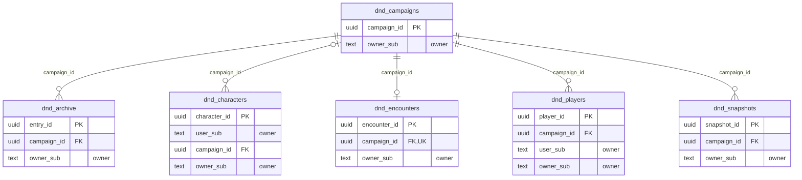

<!-- GENERATED by scripts/generate-schema-docs.js - do not edit by hand; regenerate instead. -->

# Dungeon Master (`dnd`) - database schema

Postgres database `oshal`, schema `public` - shared with the platform and every other installed package. 6 tables in the reference database.

**Migrations** (declared in `oshal-app.yaml`, applied on activation, recorded in `app_package_migrations`): `migrations/001-dnd.sql`, `migrations/002-multiplayer.sql`, `migrations/003-snapshots.sql`, `migrations/004-character-library.sql`, `migrations/005-roll-events.sql`, `migrations/006-owner-rls.sql`

Platform conventions (ownership, RLS, how migrations run): [core data model](https://github.com/emeraldcoastsystemsgroup/oshal/blob/main/docs/architecture/data-model/README.md).

The diagram shows key columns only: primary keys (PK), foreign keys (FK), single-column unique keys (UK) and the column an RLS policy scopes rows by ("owner"). A box with no columns is a table documented on another page. Every column is listed under Tables.

## Diagram

## Tables

### `dnd_archive`

Defined in `migrations/001-dnd.sql` · RLS **forced** - owner `owner_sub`; via parent `dnd_campaigns`

| Column | Type | Null | Default | Notes |
|---|---|---|---|---|
| `entry_id` | uuid | no | gen_random_uuid() | PK |
| `user_sub` | text | no |  |  |
| `campaign_id` | uuid | no |  | FK → [`dnd_campaigns.campaign_id`](#dnd_campaigns) |
| `seq` | bigint | no |  |  |
| `kind` | text | no |  |  |
| `content` | text | no |  |  |
| `created_at` | timestamp with time zone | no | now() |  |
| `payload` | jsonb | yes |  |  |
| `owner_sub` | text | no |  | owner |

### `dnd_campaigns`

Defined in `migrations/001-dnd.sql` · RLS **forced** - owner `owner_sub`

| Column | Type | Null | Default | Notes |
|---|---|---|---|---|
| `campaign_id` | uuid | no | gen_random_uuid() | PK |
| `user_sub` | text | no |  |  |
| `name` | text | no |  |  |
| `adventure_id` | text | no |  |  |
| `status` | text | no | 'active' |  |
| `created_at` | timestamp with time zone | no | now() |  |
| `updated_at` | timestamp with time zone | no | now() |  |
| `join_code` | text | yes |  |  |
| `owner_sub` | text | no |  | owner |
| `member_subs` | text[] | no | ARRAY[]::text[] |  |

### `dnd_characters`

Defined in `migrations/001-dnd.sql` · RLS **forced** - owner `owner_sub`; owner `user_sub`; via parent `dnd_campaigns`

| Column | Type | Null | Default | Notes |
|---|---|---|---|---|
| `character_id` | uuid | no | gen_random_uuid() | PK |
| `user_sub` | text | no |  | owner |
| `campaign_id` | uuid | yes |  | FK → [`dnd_campaigns.campaign_id`](#dnd_campaigns) |
| `slug` | text | no |  |  |
| `name` | text | no |  |  |
| `sheet` | jsonb | no |  |  |
| `xp` | integer | no | 0 |  |
| `level` | integer | no | 1 |  |
| `created_at` | timestamp with time zone | no | now() |  |
| `updated_at` | timestamp with time zone | no | now() |  |
| `owner_sub` | text | no |  | owner |

### `dnd_encounters`

Defined in `migrations/001-dnd.sql` · RLS **forced** - owner `owner_sub`; via parent `dnd_campaigns`

| Column | Type | Null | Default | Notes |
|---|---|---|---|---|
| `encounter_id` | uuid | no | gen_random_uuid() | PK |
| `campaign_id` | uuid | no |  | UK · FK → [`dnd_campaigns.campaign_id`](#dnd_campaigns) |
| `user_sub` | text | no |  |  |
| `adventure_id` | text | no |  |  |
| `state` | jsonb | no | '{}' |  |
| `round` | integer | no | 0 |  |
| `updated_at` | timestamp with time zone | no | now() |  |
| `rev` | bigint | no | 0 |  |
| `owner_sub` | text | no |  | owner |

### `dnd_players`

Defined in `migrations/002-multiplayer.sql` · RLS **forced** - owner `owner_sub`; owner `user_sub`; via parent `dnd_campaigns`

| Column | Type | Null | Default | Notes |
|---|---|---|---|---|
| `player_id` | uuid | no | gen_random_uuid() | PK |
| `campaign_id` | uuid | no |  | FK → [`dnd_campaigns.campaign_id`](#dnd_campaigns) |
| `user_sub` | text | no |  | owner |
| `display_name` | text | yes |  |  |
| `character_slug` | text | yes |  |  |
| `joined_at` | timestamp with time zone | no | now() |  |
| `owner_sub` | text | no |  | owner |

### `dnd_snapshots`

Defined in `migrations/003-snapshots.sql` · RLS **forced** - owner `owner_sub`; via parent `dnd_campaigns`

| Column | Type | Null | Default | Notes |
|---|---|---|---|---|
| `snapshot_id` | uuid | no | gen_random_uuid() | PK |
| `campaign_id` | uuid | no |  | FK → [`dnd_campaigns.campaign_id`](#dnd_campaigns) |
| `user_sub` | text | no |  |  |
| `label` | text | no |  |  |
| `state` | jsonb | no |  |  |
| `sheets` | jsonb | no | '{}' |  |
| `auto` | boolean | no | false |  |
| `created_at` | timestamp with time zone | no | now() |  |
| `archive_seq` | bigint | yes |  |  |
| `owner_sub` | text | no |  | owner |
