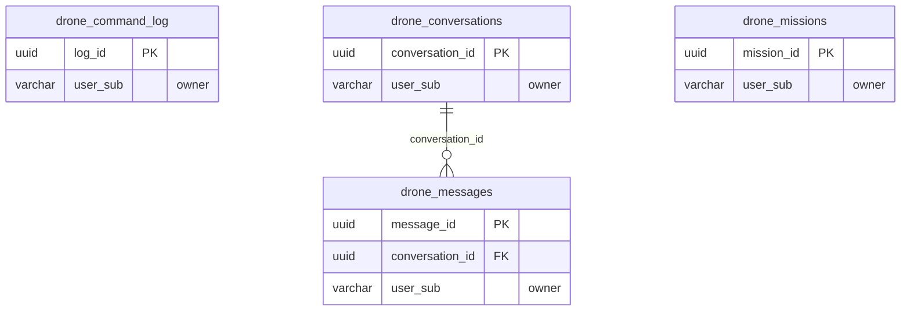

<!-- GENERATED by scripts/generate-schema-docs.js - do not edit by hand; regenerate instead. -->

# Drone Ops (`drone`) - database schema

Postgres database `oshal`, schema `public` - shared with the platform and every other installed package. 4 tables in the reference database.

**Migrations:** none declared in `oshal-app.yaml`.

**Created at runtime by package code** (`CREATE TABLE IF NOT EXISTS`): `routes/drone-routes.js`, `src-routes/drone-routes.ts`

Platform conventions (ownership, RLS, how migrations run): [core data model](https://github.com/emeraldcoastsystemsgroup/oshal/blob/main/docs/architecture/data-model/README.md).

The diagram shows key columns only: primary keys (PK), foreign keys (FK), single-column unique keys (UK) and the column an RLS policy scopes rows by ("owner"). A box with no columns is a table documented on another page. Every column is listed under Tables.

## Diagram

## Tables

### `drone_command_log`

Defined in `routes/drone-routes.js`, `src-routes/drone-routes.ts` · RLS **forced** - owner `user_sub`

| Column | Type | Null | Default | Notes |
|---|---|---|---|---|
| `log_id` | uuid | no | gen_random_uuid() | PK |
| `user_sub` | character varying(255) | no |  | owner |
| `command` | character varying(32) | no |  |  |
| `detail` | jsonb | yes |  |  |
| `outcome` | character varying(16) | no |  |  |
| `created_at` | timestamp with time zone | no | now() |  |

### `drone_conversations`

Defined in `routes/drone-routes.js`, `src-routes/drone-routes.ts` · RLS **forced** - owner `user_sub`

| Column | Type | Null | Default | Notes |
|---|---|---|---|---|
| `conversation_id` | uuid | no | gen_random_uuid() | PK |
| `user_sub` | character varying(255) | no |  | owner |
| `title` | text | yes |  |  |
| `created_at` | timestamp with time zone | no | now() |  |
| `updated_at` | timestamp with time zone | no | now() |  |

### `drone_messages`

Defined in `routes/drone-routes.js`, `src-routes/drone-routes.ts` · RLS **forced** - owner `user_sub`

| Column | Type | Null | Default | Notes |
|---|---|---|---|---|
| `message_id` | uuid | no | gen_random_uuid() | PK |
| `conversation_id` | uuid | no |  | FK → [`drone_conversations.conversation_id`](#drone_conversations) |
| `user_sub` | character varying(255) | no |  | owner |
| `role` | character varying(16) | no |  |  |
| `content` | text | no |  |  |
| `created_at` | timestamp with time zone | no | now() |  |

### `drone_missions`

Defined in `routes/drone-routes.js`, `src-routes/drone-routes.ts` · RLS **forced** - owner `user_sub`

| Column | Type | Null | Default | Notes |
|---|---|---|---|---|
| `mission_id` | uuid | no | gen_random_uuid() | PK |
| `user_sub` | character varying(255) | no |  | owner |
| `name` | text | no |  |  |
| `plan` | jsonb | no |  |  |
| `status` | character varying(16) | no | 'draft' |  |
| `source` | character varying(16) | no | 'manual' |  |
| `created_at` | timestamp with time zone | no | now() |  |
| `updated_at` | timestamp with time zone | no | now() |  |
| `last_flown_at` | timestamp with time zone | yes |  |  |
