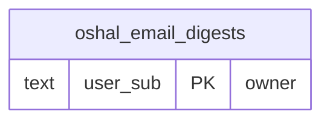

<!-- GENERATED by scripts/generate-schema-docs.js - do not edit by hand; regenerate instead. -->

# Intelligent Communication (`email-summarizer`) - database schema

Postgres database `oshal`, schema `public` - shared with the platform and every other installed package. 1 table in the reference database.

**Migrations:** none declared in `oshal-app.yaml`.

**Created at runtime by package code** (`CREATE TABLE IF NOT EXISTS`): `routes/email-app-routes.js`, `src-routes/email-app-routes.ts`

Platform conventions (ownership, RLS, how migrations run): [core data model](https://github.com/emeraldcoastsystemsgroup/oshal/blob/main/docs/architecture/data-model/README.md).

The diagram shows key columns only: primary keys (PK), foreign keys (FK), single-column unique keys (UK) and the column an RLS policy scopes rows by ("owner"). A box with no columns is a table documented on another page. Every column is listed under Tables.

## Diagram

## Tables

### `oshal_email_digests`

Defined in `routes/email-app-routes.js`, `src-routes/email-app-routes.ts` · RLS **forced** - owner `user_sub`

| Column | Type | Null | Default | Notes |
|---|---|---|---|---|
| `user_sub` | text | no |  | PK · owner |
| `summary` | text | yes |  |  |
| `updated_at` | timestamp with time zone | no | now() |  |
