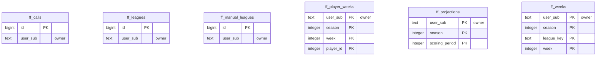

<!-- GENERATED by scripts/generate-schema-docs.js - do not edit by hand; regenerate instead. -->

# Fantasy Football (`fantasy-football`) - database schema

Postgres database `oshal`, schema `public` - shared with the platform and every other installed package. 6 tables in the reference database.

**Migrations** (declared in `oshal-app.yaml`, applied on activation, recorded in `app_package_migrations`): `migrations/001-fantasy-football.sql`, `migrations/002-fantasy-manual-and-weeks.sql`

**Created at runtime by package code** (`CREATE TABLE IF NOT EXISTS`): `routes/fantasy-store.js`, `src-routes/fantasy-store.ts`

Platform conventions (ownership, RLS, how migrations run): [core data model](https://github.com/emeraldcoastsystemsgroup/oshal/blob/main/docs/architecture/data-model/README.md).

The diagram shows key columns only: primary keys (PK), foreign keys (FK), single-column unique keys (UK) and the column an RLS policy scopes rows by ("owner"). A box with no columns is a table documented on another page. Every column is listed under Tables.

## Diagram

## Tables

### `ff_calls`

Defined in `migrations/001-fantasy-football.sql`, `routes/fantasy-store.js`, `src-routes/fantasy-store.ts` · RLS **forced** - owner `user_sub`

| Column | Type | Null | Default | Notes |
|---|---|---|---|---|
| `id` | bigint | no | nextval('ff_calls_id_seq') | PK |
| `user_sub` | text | no |  | owner |
| `season` | integer | no |  |  |
| `league_id` | text | no |  |  |
| `week` | integer | no |  |  |
| `start_player_id` | integer | no |  |  |
| `start_player_name` | text | yes |  |  |
| `sit_player_id` | integer | no |  |  |
| `sit_player_name` | text | yes |  |  |
| `slot_id` | integer | yes |  |  |
| `projected_start` | numeric(7,2) | yes |  |  |
| `projected_sit` | numeric(7,2) | yes |  |  |
| `projected_gain` | numeric(7,2) | no |  |  |
| `reason` | text | yes |  |  |
| `settled` | boolean | no | false |  |
| `actual_start` | numeric(7,2) | yes |  |  |
| `actual_sit` | numeric(7,2) | yes |  |  |
| `actual_gain` | numeric(7,2) | yes |  |  |
| `graded_at` | timestamp with time zone | yes |  |  |
| `created_at` | timestamp with time zone | no | now() |  |

### `ff_leagues`

Defined in `migrations/001-fantasy-football.sql`, `routes/fantasy-store.js`, `src-routes/fantasy-store.ts` · RLS **forced** - owner `user_sub`

| Column | Type | Null | Default | Notes |
|---|---|---|---|---|
| `id` | bigint | no | nextval('ff_leagues_id_seq') | PK |
| `user_sub` | text | no |  | owner |
| `season` | integer | no |  |  |
| `league_id` | text | no |  |  |
| `league_name` | text | yes |  |  |
| `team_id` | integer | yes |  |  |
| `team_name` | text | yes |  |  |
| `linked_at` | timestamp with time zone | no | now() |  |

### `ff_manual_leagues`

Defined in `routes/fantasy-store.js`, `src-routes/fantasy-store.ts` · RLS **forced** - owner `user_sub`

| Column | Type | Null | Default | Notes |
|---|---|---|---|---|
| `id` | bigint | no | nextval('ff_manual_leagues_id_seq') | PK |
| `user_sub` | text | no |  | owner |
| `name` | text | no |  |  |
| `season` | integer | no |  |  |
| `doc` | jsonb | no |  |  |
| `created_at` | timestamp with time zone | no | now() |  |
| `updated_at` | timestamp with time zone | no | now() |  |

### `ff_player_weeks`

Defined in `migrations/001-fantasy-football.sql`, `routes/fantasy-store.js`, `src-routes/fantasy-store.ts` · RLS **forced** - owner `user_sub`

| Column | Type | Null | Default | Notes |
|---|---|---|---|---|
| `user_sub` | text | no |  | PK · owner |
| `season` | integer | no |  | PK |
| `week` | integer | no |  | PK |
| `player_id` | integer | no |  | PK |
| `stats` | jsonb | no |  |  |
| `updated_at` | timestamp with time zone | no | now() |  |

### `ff_projections`

Defined in `migrations/001-fantasy-football.sql`, `routes/fantasy-store.js`, `src-routes/fantasy-store.ts` · RLS **forced** - owner `user_sub`

| Column | Type | Null | Default | Notes |
|---|---|---|---|---|
| `user_sub` | text | no |  | PK · owner |
| `season` | integer | no |  | PK |
| `scoring_period` | integer | no |  | PK |
| `payload` | jsonb | no |  |  |
| `players` | integer | no | 0 |  |
| `generated_at` | timestamp with time zone | no | now() |  |
| `build_ms` | integer | yes |  |  |

### `ff_weeks`

Defined in `routes/fantasy-store.js`, `src-routes/fantasy-store.ts` · RLS **forced** - owner `user_sub`

| Column | Type | Null | Default | Notes |
|---|---|---|---|---|
| `user_sub` | text | no |  | PK · owner |
| `season` | integer | no |  | PK |
| `league_key` | text | no |  | PK |
| `week` | integer | no |  | PK |
| `source` | text | no |  |  |
| `advised` | jsonb | no |  |  |
| `mean_lineup` | jsonb | no |  |  |
| `started` | jsonb | no |  |  |
| `swaps` | jsonb | no | '[]' |  |
| `win_probability` | numeric(6,4) | yes |  |  |
| `mean_win_probability` | numeric(6,4) | yes |  |  |
| `projected_advised` | numeric(7,2) | yes |  |  |
| `projected_started` | numeric(7,2) | yes |  |  |
| `graded` | boolean | no | false |  |
| `actual_advised` | numeric(7,2) | yes |  |  |
| `actual_started` | numeric(7,2) | yes |  |  |
| `actual_gain` | numeric(7,2) | yes |  |  |
| `recorded_at` | timestamp with time zone | no | now() |  |
| `graded_at` | timestamp with time zone | yes |  |  |
