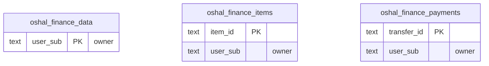

<!-- GENERATED by scripts/generate-schema-docs.js - do not edit by hand; regenerate instead. -->

# Finance (`finance`) - database schema

Postgres database `oshal`, schema `public` - shared with the platform and every other installed package. 3 tables in the reference database.

**Migrations:** none declared in `oshal-app.yaml`.

**Created at runtime by package code** (`CREATE TABLE IF NOT EXISTS`): `routes/finance-routes.js`, `src-routes/finance-routes.ts`

Platform conventions (ownership, RLS, how migrations run): [core data model](https://github.com/emeraldcoastsystemsgroup/oshal/blob/main/docs/architecture/data-model/README.md).

The diagram shows key columns only: primary keys (PK), foreign keys (FK), single-column unique keys (UK) and the column an RLS policy scopes rows by ("owner"). A box with no columns is a table documented on another page. Every column is listed under Tables.

## Diagram

## Tables

### `oshal_finance_data`

Defined in `routes/finance-routes.js`, `src-routes/finance-routes.ts` · RLS **forced** - owner `user_sub`

| Column | Type | Null | Default | Notes |
|---|---|---|---|---|
| `user_sub` | text | no |  | PK · owner |
| `aggregate` | jsonb | yes |  |  |
| `brief` | text | yes |  |  |
| `synced_at` | timestamp with time zone | yes |  |  |
| `brief_at` | timestamp with time zone | yes |  |  |

### `oshal_finance_items`

Defined in `routes/finance-routes.js`, `src-routes/finance-routes.ts` · RLS **forced** - owner `user_sub`

| Column | Type | Null | Default | Notes |
|---|---|---|---|---|
| `item_id` | text | no |  | PK |
| `user_sub` | text | no |  | owner |
| `institution` | text | yes |  |  |
| `access_token` | text | no |  |  |
| `linked_at` | timestamp with time zone | no | now() |  |

### `oshal_finance_payments`

Defined in `routes/finance-routes.js`, `src-routes/finance-routes.ts` · RLS **forced** - owner `user_sub`

| Column | Type | Null | Default | Notes |
|---|---|---|---|---|
| `transfer_id` | text | no |  | PK |
| `user_sub` | text | no |  | owner |
| `provider` | text | no |  |  |
| `amount_cents` | bigint | no |  |  |
| `currency` | text | no |  |  |
| `payee` | text | yes |  |  |
| `description` | text | yes |  |  |
| `status` | text | no |  |  |
| `raw_status` | text | yes |  |  |
| `test_mode` | boolean | no | true |  |
| `created_at` | timestamp with time zone | no | now() |  |
| `updated_at` | timestamp with time zone | no | now() |  |
