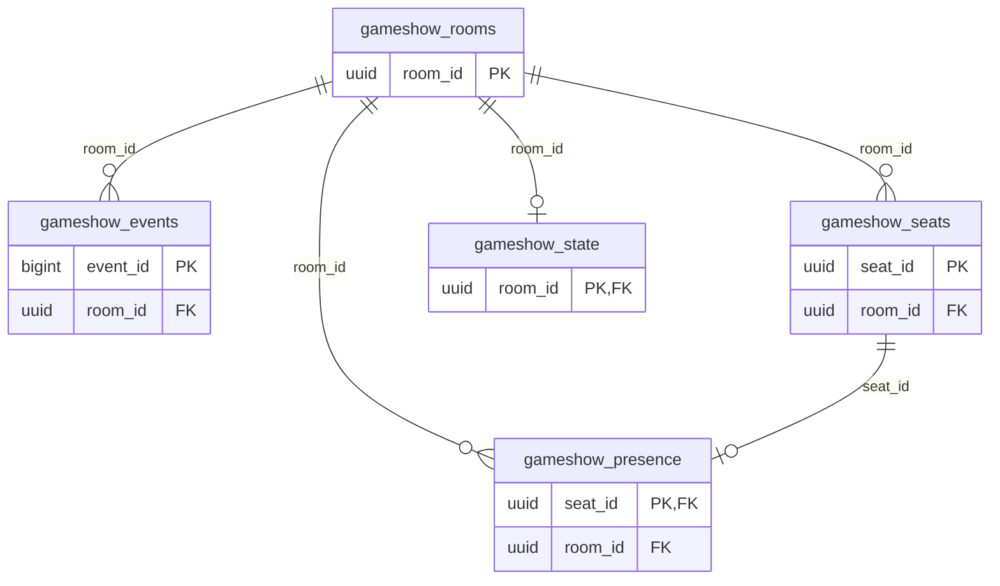

<!-- GENERATED by scripts/generate-schema-docs.js - do not edit by hand; regenerate instead. -->

# Game Show (`game-show`) - database schema

Postgres database `oshal`, schema `public` - shared with the platform and every other installed package. 5 tables in the reference database.

**Migrations** (declared in `oshal-app.yaml`, applied on activation, recorded in `app_package_migrations`): `migrations/001-game-show.sql`

Platform conventions (ownership, RLS, how migrations run): [core data model](https://github.com/emeraldcoastsystemsgroup/oshal/blob/main/docs/architecture/data-model/README.md).

The diagram shows key columns only: primary keys (PK), foreign keys (FK), single-column unique keys (UK) and the column an RLS policy scopes rows by ("owner"). A box with no columns is a table documented on another page. Every column is listed under Tables.

## Diagram

## Tables

### `gameshow_events`

Defined in `migrations/001-game-show.sql` · RLS **off**

| Column | Type | Null | Default | Notes |
|---|---|---|---|---|
| `event_id` | bigint | no | nextval('gameshow_events_event_id_seq') | PK |
| `room_id` | uuid | no |  | FK → [`gameshow_rooms.room_id`](#gameshow_rooms) |
| `user_sub` | text | no |  |  |
| `seq` | integer | no |  |  |
| `kind` | text | no |  |  |
| `content` | text | no | '' |  |
| `created_at` | timestamp with time zone | no | now() |  |

### `gameshow_presence`

Defined in `migrations/001-game-show.sql` · RLS **off**

| Column | Type | Null | Default | Notes |
|---|---|---|---|---|
| `seat_id` | uuid | no |  | PK · FK → [`gameshow_seats.seat_id`](#gameshow_seats) |
| `room_id` | uuid | no |  | FK → [`gameshow_rooms.room_id`](#gameshow_rooms) |
| `mime` | text | no | 'image/jpeg' |  |
| `frame` | bytea | yes |  |  |
| `updated_at` | timestamp with time zone | no | now() |  |

### `gameshow_rooms`

Defined in `migrations/001-game-show.sql` · RLS **off**

| Column | Type | Null | Default | Notes |
|---|---|---|---|---|
| `room_id` | uuid | no | gen_random_uuid() | PK |
| `user_sub` | text | no |  |  |
| `show_id` | text | no | 'family-feud' |  |
| `name` | text | yes |  |  |
| `join_code` | text | no |  |  |
| `status` | text | no | 'lobby' |  |
| `created_at` | timestamp with time zone | no | now() |  |
| `updated_at` | timestamp with time zone | no | now() |  |

### `gameshow_seats`

Defined in `migrations/001-game-show.sql` · RLS **off**

| Column | Type | Null | Default | Notes |
|---|---|---|---|---|
| `seat_id` | uuid | no | gen_random_uuid() | PK |
| `room_id` | uuid | no |  | FK → [`gameshow_rooms.room_id`](#gameshow_rooms) |
| `user_sub` | text | no |  |  |
| `display_name` | text | yes |  |  |
| `team` | text | yes |  |  |
| `podium_index` | integer | yes |  |  |
| `role` | text | no | 'player' |  |
| `presence_kind` | text | no | 'avatar' |  |
| `avatar_id` | text | yes |  |  |
| `presence_rev` | bigint | no | 0 |  |
| `score` | integer | no | 0 |  |
| `joined_at` | timestamp with time zone | no | now() |  |

### `gameshow_state`

Defined in `migrations/001-game-show.sql` · RLS **off**

| Column | Type | Null | Default | Notes |
|---|---|---|---|---|
| `room_id` | uuid | no |  | PK · FK → [`gameshow_rooms.room_id`](#gameshow_rooms) |
| `user_sub` | text | no |  |  |
| `state` | jsonb | no | '{}' |  |
| `rev` | bigint | no | 0 |  |
| `updated_at` | timestamp with time zone | no | now() |  |
