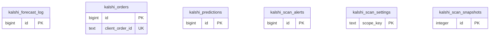

<!-- GENERATED by scripts/generate-schema-docs.js - do not edit by hand; regenerate instead. -->

# Kalshi Prediction Markets (`kalshi`) - database schema

Postgres database `oshal`, schema `public` - shared with the platform and every other installed package. 6 tables in the reference database.

**Migrations** (declared in `oshal-app.yaml`, applied on activation, recorded in `app_package_migrations`): `migrations/074-kalshi-orders.sql`, `migrations/075-kalshi-forward-test.sql`, `migrations/076-kalshi-scan-automation.sql`

**Created at runtime by package code** (`CREATE TABLE IF NOT EXISTS`): `routes/kalshi-routes.js`, `routes/kalshi-scan-engine.js`, `src-routes/kalshi-routes.ts`, `src-routes/kalshi-scan-engine.ts`

Platform conventions (ownership, RLS, how migrations run): [core data model](https://github.com/emeraldcoastsystemsgroup/oshal/blob/main/docs/architecture/data-model/README.md).

The diagram shows key columns only: primary keys (PK), foreign keys (FK), single-column unique keys (UK) and the column an RLS policy scopes rows by ("owner"). A box with no columns is a table documented on another page. Every column is listed under Tables.

## Diagram

## Tables

### `kalshi_forecast_log`

Defined in `migrations/075-kalshi-forward-test.sql` · RLS **off**

Also declared by core (`scripts/migrations/075-kalshi-forward-test.sql`).

| Column | Type | Null | Default | Notes |
|---|---|---|---|---|
| `id` | bigint | no | nextval('kalshi_forecast_log_id_seq') | PK |
| `series_ticker` | text | no |  |  |
| `target_date` | date | no |  |  |
| `lead_days` | integer | no |  |  |
| `enso_phase` | text | no |  |  |
| `oni` | numeric(4,2) | yes |  |  |
| `forecast_f` | numeric(5,1) | no |  |  |
| `actual_f` | numeric(5,1) | yes |  |  |
| `created_at` | timestamp with time zone | no | now() |  |

### `kalshi_orders`

Defined in `migrations/074-kalshi-orders.sql`, `routes/kalshi-routes.js`, `src-routes/kalshi-routes.ts` · RLS **off**

Also declared by core (`scripts/migrations/074-kalshi-orders.sql`).

| Column | Type | Null | Default | Notes |
|---|---|---|---|---|
| `id` | bigint | no | nextval('kalshi_orders_id_seq') | PK |
| `user_sub` | text | no |  |  |
| `env` | text | no |  |  |
| `ticker` | text | no |  |  |
| `side` | text | no |  |  |
| `action` | text | no |  |  |
| `count` | integer | no |  |  |
| `limit_price_cents` | integer | no |  |  |
| `client_order_id` | text | no |  | UK |
| `kalshi_order_id` | text | yes |  |  |
| `kalshi_status` | text | yes |  |  |
| `hand_snapshot` | jsonb | yes |  |  |
| `error` | text | yes |  |  |
| `created_at` | timestamp with time zone | no | now() |  |

### `kalshi_predictions`

Defined in `migrations/075-kalshi-forward-test.sql` · RLS **off**

Also declared by core (`scripts/migrations/075-kalshi-forward-test.sql`).

| Column | Type | Null | Default | Notes |
|---|---|---|---|---|
| `id` | bigint | no | nextval('kalshi_predictions_id_seq') | PK |
| `strategy` | text | no |  |  |
| `ticker` | text | no |  |  |
| `event_ticker` | text | yes |  |  |
| `series_ticker` | text | yes |  |  |
| `predicted_prob` | numeric(6,5) | no |  |  |
| `market_prob` | numeric(6,5) | no |  |  |
| `edge_net` | numeric(6,5) | no |  |  |
| `stake_fraction` | numeric(6,5) | no | 0 |  |
| `side` | text | no |  |  |
| `rationale` | jsonb | yes |  |  |
| `paper_traded` | boolean | no | false |  |
| `kalshi_order_id` | text | yes |  |  |
| `settled` | boolean | no | false |  |
| `settled_yes` | boolean | yes |  |  |
| `brier` | numeric(8,6) | yes |  |  |
| `market_brier` | numeric(8,6) | yes |  |  |
| `pnl_per_contract` | numeric(8,4) | yes |  |  |
| `graded_at` | timestamp with time zone | yes |  |  |
| `close_time` | timestamp with time zone | yes |  |  |
| `created_at` | timestamp with time zone | no | now() |  |

### `kalshi_scan_alerts`

Defined in `migrations/076-kalshi-scan-automation.sql`, `routes/kalshi-scan-engine.js`, `src-routes/kalshi-scan-engine.ts` · RLS **off**

| Column | Type | Null | Default | Notes |
|---|---|---|---|---|
| `id` | bigint | no | nextval('kalshi_scan_alerts_id_seq') | PK |
| `user_sub` | text | no |  |  |
| `ticker` | text | no |  |  |
| `strength` | text | yes |  |  |
| `edge_net` | numeric | yes |  |  |
| `channel` | text | yes |  |  |
| `delivered` | boolean | no | false |  |
| `detail` | jsonb | yes |  |  |
| `created_at` | timestamp with time zone | no | now() |  |
| `batch_id` | uuid | yes |  |  |

### `kalshi_scan_settings`

Defined in `migrations/076-kalshi-scan-automation.sql`, `routes/kalshi-scan-engine.js`, `src-routes/kalshi-scan-engine.ts` · RLS **off**

| Column | Type | Null | Default | Notes |
|---|---|---|---|---|
| `scope_key` | text | no |  | PK |
| `settings` | jsonb | no | '{}' |  |
| `updated_at` | timestamp with time zone | no | now() |  |

### `kalshi_scan_snapshots`

Defined in `migrations/076-kalshi-scan-automation.sql`, `routes/kalshi-scan-engine.js`, `src-routes/kalshi-scan-engine.ts` · RLS **off**

| Column | Type | Null | Default | Notes |
|---|---|---|---|---|
| `id` | integer | no |  | PK |
| `payload` | jsonb | no |  |  |
| `generated_at` | timestamp with time zone | no | now() |  |
| `scan_ms` | integer | yes |  |  |
