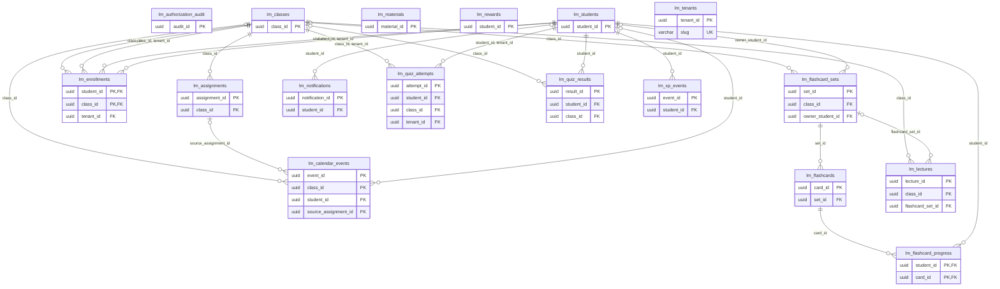

<!-- GENERATED by scripts/generate-schema-docs.js - do not edit by hand; regenerate instead. -->

# Little Monsters (`little-monsters`) - database schema

Postgres database `oshal`, schema `public` - shared with the platform and every other installed package. 17 tables in the reference database.

**Migrations** (declared in `oshal-app.yaml`, applied on activation, recorded in `app_package_migrations`): `migrations/019-education-platform.sql`, `migrations/020-seed-education-bots.sql`, `migrations/021-calendar-and-notifications.sql`, `migrations/024-lecture-slides.sql`, `migrations/025-calendar-google-sync.sql`, `migrations/026-education-identity.sql`, `migrations/027-class-publishing.sql`, `migrations/028-class-materials.sql`, `migrations/029-material-sharing.sql`, `migrations/030-multi-tenant.sql`, `migrations/031-tenant-domain-uniqueness.sql`, `migrations/032-oidc-principal-binding.sql`, `migrations/033-flashcard-set-ownership.sql`, `migrations/034-material-rag-lifecycle.sql`, `migrations/035-enrollment-tenant-invariant.sql`, `migrations/036-authoritative-progress.sql`, `migrations/037-authorization-audit.sql`

**Created at runtime by package code** (`CREATE TABLE IF NOT EXISTS`): `routes/education-rewards-routes.js`, `routes/education-schema.js`, `src-routes/education-rewards-routes.ts`, `src-routes/education-schema.ts`

Platform conventions (ownership, RLS, how migrations run): [core data model](https://github.com/emeraldcoastsystemsgroup/oshal/blob/main/docs/architecture/data-model/README.md).

The diagram shows key columns only: primary keys (PK), foreign keys (FK), single-column unique keys (UK) and the column an RLS policy scopes rows by ("owner"). A box with no columns is a table documented on another page. Every column is listed under Tables.

## Diagram

## Tables

### `lm_assignments`

Defined in `migrations/019-education-platform.sql` · RLS **off**

| Column | Type | Null | Default | Notes |
|---|---|---|---|---|
| `assignment_id` | uuid | no | gen_random_uuid() | PK |
| `class_id` | uuid | no |  | FK → [`lm_classes.class_id`](#lm_classes) |
| `title` | character varying(500) | no |  |  |
| `description` | text | yes | '' |  |
| `assignment_type` | character varying(30) | no | 'homework' |  |
| `due_date` | date | yes |  |  |
| `source_lecture_date` | date | yes |  |  |
| `resources` | jsonb | no | '[]' |  |
| `status` | character varying(20) | no | 'active' |  |
| `created_at` | timestamp with time zone | no | now() |  |

### `lm_authorization_audit`

> Append-only Little Monsters authorization audit; actor, student, class, action, and database timestamp.

Defined in `migrations/037-authorization-audit.sql`, `routes/education-schema.js`, `src-routes/education-schema.ts` · RLS **off**

| Column | Type | Null | Default | Notes |
|---|---|---|---|---|
| `audit_id` | uuid | no | gen_random_uuid() | PK |
| `actor_student_id` | uuid | no |  |  |
| `student_id` | uuid | no |  |  |
| `class_id` | uuid | no |  |  |
| `action` | character varying(64) | no |  |  |
| `occurred_at` | timestamp with time zone | no | clock_timestamp() |  |

### `lm_calendar_events`

Defined in `migrations/021-calendar-and-notifications.sql` · RLS **off**

| Column | Type | Null | Default | Notes |
|---|---|---|---|---|
| `event_id` | uuid | no | gen_random_uuid() | PK |
| `class_id` | uuid | yes |  | FK → [`lm_classes.class_id`](#lm_classes) |
| `student_id` | uuid | yes |  | FK → [`lm_students.student_id`](#lm_students) |
| `title` | character varying(500) | no |  |  |
| `description` | text | yes | '' |  |
| `event_type` | character varying(30) | no | 'assignment' |  |
| `event_date` | date | no |  |  |
| `event_time` | time without time zone | yes |  |  |
| `source_assignment_id` | uuid | yes |  | FK → [`lm_assignments.assignment_id`](#lm_assignments) |
| `remind_at` | timestamp with time zone | yes |  |  |
| `reminder_sent` | boolean | no | false |  |
| `metadata` | jsonb | no | '{}' |  |
| `created_at` | timestamp with time zone | no | now() |  |
| `google_event_id` | character varying(255) | yes |  |  |
| `google_synced_at` | timestamp with time zone | yes |  |  |

### `lm_classes`

Defined in `migrations/019-education-platform.sql` · RLS **off**

| Column | Type | Null | Default | Notes |
|---|---|---|---|---|
| `class_id` | uuid | no | gen_random_uuid() | PK |
| `name` | character varying(255) | no |  |  |
| `subject` | character varying(100) | no |  |  |
| `grade_level` | character varying(20) | yes |  |  |
| `teacher_name` | character varying(255) | yes |  |  |
| `description` | text | yes | '' |  |
| `chroma_collection_prefix` | character varying(100) | no |  |  |
| `status` | character varying(20) | no | 'active' |  |
| `metadata` | jsonb | no | '{}' |  |
| `created_at` | timestamp with time zone | no | now() |  |
| `updated_at` | timestamp with time zone | no | now() |  |
| `teacher_student_id` | uuid | yes |  |  |
| `published` | boolean | no | false |  |
| `tenant_id` | uuid | no | '00000000-0000-4000-8000-00000000d001' |  |

### `lm_enrollments`

Defined in `migrations/019-education-platform.sql` · RLS **off**

| Column | Type | Null | Default | Notes |
|---|---|---|---|---|
| `student_id` | uuid | no |  | PK · FK → [`lm_students.student_id`](#lm_students) · FK → [`lm_students.student_id`](#lm_students) |
| `class_id` | uuid | no |  | PK · FK → [`lm_classes.class_id`](#lm_classes) · FK → [`lm_classes.class_id`](#lm_classes) |
| `enrolled_at` | timestamp with time zone | no | now() |  |
| `tenant_id` | uuid | no |  | FK → [`lm_classes.tenant_id`](#lm_classes) · FK → [`lm_students.tenant_id`](#lm_students) |

### `lm_flashcard_progress`

Defined in `migrations/019-education-platform.sql` · RLS **off**

| Column | Type | Null | Default | Notes |
|---|---|---|---|---|
| `student_id` | uuid | no |  | PK · FK → [`lm_students.student_id`](#lm_students) |
| `card_id` | uuid | no |  | PK · FK → [`lm_flashcards.card_id`](#lm_flashcards) |
| `repetitions` | integer | no | 0 |  |
| `ease_factor` | real | no | 2.5 |  |
| `interval_days` | integer | no | 1 |  |
| `next_review` | date | no | CURRENT_DATE |  |
| `last_reviewed` | timestamp with time zone | yes |  |  |

### `lm_flashcard_sets`

Defined in `migrations/019-education-platform.sql` · RLS **off**

| Column | Type | Null | Default | Notes |
|---|---|---|---|---|
| `set_id` | uuid | no | gen_random_uuid() | PK |
| `class_id` | uuid | yes |  | FK → [`lm_classes.class_id`](#lm_classes) |
| `title` | character varying(255) | no |  |  |
| `topic` | character varying(100) | yes |  |  |
| `source_type` | character varying(30) | yes | 'lecture' |  |
| `source_reference` | character varying(500) | yes |  |  |
| `card_count` | integer | no | 0 |  |
| `created_at` | timestamp with time zone | no | now() |  |
| `owner_student_id` | uuid | yes |  | FK → [`lm_students.student_id`](#lm_students) |

### `lm_flashcards`

Defined in `migrations/019-education-platform.sql` · RLS **off**

| Column | Type | Null | Default | Notes |
|---|---|---|---|---|
| `card_id` | uuid | no | gen_random_uuid() | PK |
| `set_id` | uuid | no |  | FK → [`lm_flashcard_sets.set_id`](#lm_flashcard_sets) |
| `front` | text | no |  |  |
| `back` | text | no |  |  |
| `card_type` | character varying(20) | no | 'concept' |  |
| `difficulty` | integer | no | 2 |  |
| `topic` | character varying(100) | yes |  |  |
| `hints` | jsonb | no | '[]' |  |
| `created_at` | timestamp with time zone | no | now() |  |

### `lm_lectures`

Defined in `migrations/019-education-platform.sql` · RLS **off**

| Column | Type | Null | Default | Notes |
|---|---|---|---|---|
| `lecture_id` | uuid | no | gen_random_uuid() | PK |
| `class_id` | uuid | no |  | FK → [`lm_classes.class_id`](#lm_classes) |
| `lecture_date` | date | no | CURRENT_DATE |  |
| `audio_path` | character varying(500) | yes |  |  |
| `transcript_path` | character varying(500) | yes |  |  |
| `notes_path` | character varying(500) | yes |  |  |
| `assignments_path` | character varying(500) | yes |  |  |
| `flashcard_set_id` | uuid | yes |  | FK → [`lm_flashcard_sets.set_id`](#lm_flashcard_sets) |
| `ticket_id` | uuid | yes |  |  |
| `status` | character varying(20) | no | 'pending' |  |
| `duration_seconds` | integer | yes |  |  |
| `created_at` | timestamp with time zone | no | now() |  |
| `slides_path` | character varying(500) | yes |  |  |

### `lm_materials`

Defined in `migrations/028-class-materials.sql`, `routes/education-schema.js`, `src-routes/education-schema.ts` · RLS **off**

| Column | Type | Null | Default | Notes |
|---|---|---|---|---|
| `material_id` | uuid | no | gen_random_uuid() | PK |
| `class_id` | uuid | no |  |  |
| `uploaded_by` | uuid | yes |  |  |
| `original_name` | text | yes |  |  |
| `stored_path` | text | no |  |  |
| `mime_type` | text | yes |  |  |
| `size_bytes` | bigint | yes | 0 |  |
| `kind` | character varying(20) | no | 'document' |  |
| `title` | text | yes |  |  |
| `created_at` | timestamp with time zone | no | now() |  |
| `shared` | boolean | no | false |  |
| `share_status` | character varying(20) | no | 'private' |  |
| `rag_collection` | character varying(63) | yes |  |  |

### `lm_notifications`

Defined in `migrations/021-calendar-and-notifications.sql` · RLS **off**

| Column | Type | Null | Default | Notes |
|---|---|---|---|---|
| `notification_id` | uuid | no | gen_random_uuid() | PK |
| `student_id` | uuid | yes |  | FK → [`lm_students.student_id`](#lm_students) |
| `title` | character varying(500) | no |  |  |
| `body` | text | no |  |  |
| `channel` | character varying(20) | no | 'in-app' |  |
| `read` | boolean | no | false |  |
| `sent_at` | timestamp with time zone | no | now() |  |
| `metadata` | jsonb | no | '{}' |  |

### `lm_quiz_attempts`

Defined in `migrations/036-authoritative-progress.sql`, `routes/education-schema.js`, `src-routes/education-schema.ts` · RLS **off**

| Column | Type | Null | Default | Notes |
|---|---|---|---|---|
| `attempt_id` | uuid | no | gen_random_uuid() | PK |
| `student_id` | uuid | no |  | FK → [`lm_students.student_id`](#lm_students) |
| `class_id` | uuid | no |  | FK → [`lm_classes.class_id`](#lm_classes) |
| `tenant_id` | uuid | no |  | FK → [`lm_classes.tenant_id`](#lm_classes) · FK → [`lm_students.tenant_id`](#lm_students) |
| `questions` | jsonb | no |  |  |
| `expires_at` | timestamp with time zone | no | (now() + '00:30:00'::interval) |  |
| `completed_at` | timestamp with time zone | yes |  |  |
| `created_at` | timestamp with time zone | no | now() |  |

### `lm_quiz_results`

Defined in `migrations/019-education-platform.sql` · RLS **off**

| Column | Type | Null | Default | Notes |
|---|---|---|---|---|
| `result_id` | uuid | no | gen_random_uuid() | PK |
| `student_id` | uuid | no |  | FK → [`lm_students.student_id`](#lm_students) |
| `class_id` | uuid | yes |  | FK → [`lm_classes.class_id`](#lm_classes) |
| `score_percent` | integer | no |  |  |
| `total_questions` | integer | no |  |  |
| `correct_answers` | integer | no |  |  |
| `topics` | jsonb | no | '[]' |  |
| `missed_questions` | jsonb | no | '[]' |  |
| `completed_at` | timestamp with time zone | no | now() |  |

### `lm_rewards`

Defined in `routes/education-rewards-routes.js`, `src-routes/education-rewards-routes.ts` · RLS **off**

| Column | Type | Null | Default | Notes |
|---|---|---|---|---|
| `student_id` | uuid | no |  | PK |
| `boxes` | integer | no | 0 |  |
| `inventory` | jsonb | no | '[]' |  |
| `equipped` | jsonb | no | '{}' |  |
| `updated_at` | timestamp with time zone | no | now() |  |

### `lm_students`

Defined in `migrations/019-education-platform.sql` · RLS **off**

| Column | Type | Null | Default | Notes |
|---|---|---|---|---|
| `student_id` | uuid | no | gen_random_uuid() | PK |
| `name` | character varying(255) | no |  |  |
| `email` | character varying(255) | yes |  |  |
| `xp` | integer | no | 0 |  |
| `level` | integer | no | 1 |  |
| `streak_days` | integer | no | 0 |  |
| `last_active_date` | date | yes |  |  |
| `metadata` | jsonb | no | '{}' |  |
| `created_at` | timestamp with time zone | no | now() |  |
| `updated_at` | timestamp with time zone | no | now() |  |
| `external_id` | character varying(255) | yes |  |  |
| `role` | character varying(20) | no | 'student' |  |
| `tenant_id` | uuid | no | '00000000-0000-4000-8000-00000000d001' |  |
| `external_issuer` | text | yes |  |  |

### `lm_tenants`

Defined in `migrations/030-multi-tenant.sql`, `routes/education-schema.js`, `src-routes/education-schema.ts` · RLS **off**

| Column | Type | Null | Default | Notes |
|---|---|---|---|---|
| `tenant_id` | uuid | no | gen_random_uuid() | PK |
| `slug` | character varying(64) | no |  | UK |
| `name` | text | no |  |  |
| `domain` | character varying(255) | yes |  |  |
| `created_at` | timestamp with time zone | no | now() |  |

### `lm_xp_events`

Defined in `migrations/019-education-platform.sql` · RLS **off**

| Column | Type | Null | Default | Notes |
|---|---|---|---|---|
| `event_id` | uuid | no | gen_random_uuid() | PK |
| `student_id` | uuid | no |  | FK → [`lm_students.student_id`](#lm_students) |
| `event_type` | character varying(50) | no |  |  |
| `xp_amount` | integer | no |  |  |
| `metadata` | jsonb | no | '{}' |  |
| `created_at` | timestamp with time zone | no | now() |  |
| `dedupe_key` | character varying(160) | yes |  |  |
