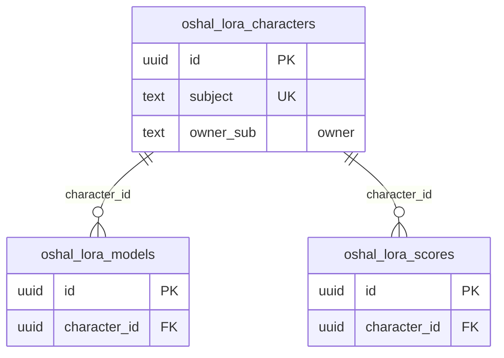

<!-- GENERATED by scripts/generate-schema-docs.js - do not edit by hand; regenerate instead. -->

# LoRA Studio (`lora`) - database schema

Postgres database `oshal`, schema `public` - shared with the platform and every other installed package. 3 tables in the reference database.

**Migrations** (declared in `oshal-app.yaml`, applied on activation, recorded in `app_package_migrations`): `migrations/058-lora-studio.sql`, `migrations/100-lora-owner-rls.sql`

**Created at runtime by package code** (`CREATE TABLE IF NOT EXISTS`): `routes/bot-lora-routes.js`, `src-routes/bot-lora-routes.ts`

Platform conventions (ownership, RLS, how migrations run): [core data model](https://github.com/emeraldcoastsystemsgroup/oshal/blob/main/docs/architecture/data-model/README.md).

The diagram shows key columns only: primary keys (PK), foreign keys (FK), single-column unique keys (UK) and the column an RLS policy scopes rows by ("owner"). A box with no columns is a table documented on another page. Every column is listed under Tables.

## Diagram

## Tables

### `oshal_lora_characters`

Defined in `migrations/058-lora-studio.sql`, `routes/bot-lora-routes.js`, `src-routes/bot-lora-routes.ts` · RLS **forced** - owner `owner_sub`

| Column | Type | Null | Default | Notes |
|---|---|---|---|---|
| `id` | uuid | no | gen_random_uuid() | PK |
| `subject` | text | no |  | UK |
| `display_name` | text | no |  |  |
| `trigger_word` | text | no |  |  |
| `hero_image` | text | yes |  |  |
| `base_model` | text | no | 'v1-5-pruned-emaonly-fp16.safetensors' |  |
| `ident_prompt` | text | yes |  |  |
| `autonomous` | boolean | no | false |  |
| `max_hours` | numeric(5,2) | no | 9 |  |
| `plateau_epsilon` | numeric(6,4) | no | 0.0050 |  |
| `active_version` | integer | yes |  |  |
| `owner_sub` | text | yes |  | owner |
| `created_at` | timestamp with time zone | no | now() |  |

### `oshal_lora_models`

Defined in `migrations/058-lora-studio.sql`, `routes/bot-lora-routes.js`, `src-routes/bot-lora-routes.ts` · RLS **off**

| Column | Type | Null | Default | Notes |
|---|---|---|---|---|
| `id` | uuid | no | gen_random_uuid() | PK |
| `character_id` | uuid | no |  | FK → [`oshal_lora_characters.id`](#oshal_lora_characters) |
| `version` | integer | no |  |  |
| `status` | text | no | 'queued' |  |
| `lora_path` | text | yes |  |  |
| `base_model` | text | yes |  |  |
| `dataset_count` | integer | yes |  |  |
| `network_dim` | integer | yes |  |  |
| `epochs` | integer | yes |  |  |
| `steps` | integer | yes |  |  |
| `final_loss` | numeric(10,5) | yes |  |  |
| `duration_sec` | integer | yes |  |  |
| `parent_version` | integer | yes |  |  |
| `ticket_id` | text | yes |  |  |
| `metrics` | jsonb | yes |  |  |
| `created_at` | timestamp with time zone | no | now() |  |

### `oshal_lora_scores`

Defined in `migrations/058-lora-studio.sql`, `routes/bot-lora-routes.js`, `src-routes/bot-lora-routes.ts` · RLS **off**

| Column | Type | Null | Default | Notes |
|---|---|---|---|---|
| `id` | uuid | no | gen_random_uuid() | PK |
| `character_id` | uuid | no |  | FK → [`oshal_lora_characters.id`](#oshal_lora_characters) |
| `version` | integer | no |  |  |
| `overall` | numeric(6,4) | yes |  |  |
| `identity_mean` | numeric(6,4) | yes |  |  |
| `quality_mean` | numeric(6,4) | yes |  |  |
| `min_cell` | numeric(6,4) | yes |  |  |
| `cells` | jsonb | yes |  |  |
| `weak_cells` | jsonb | yes |  |  |
| `gallery_url` | text | yes |  |  |
| `created_at` | timestamp with time zone | no | now() |  |
