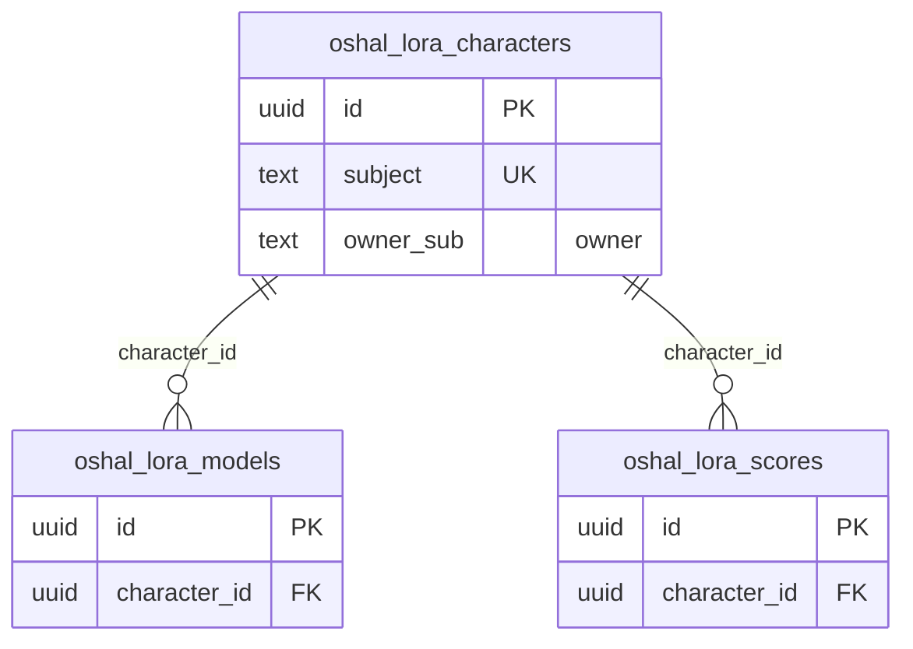

<!-- GENERATED by scripts/generate-schema-docs.js - do not edit by hand; regenerate instead. -->

# LoRA Studio (`lora`) - database schema

Postgres database `oshal`, schema `public` - shared with the platform and every other installed package. 3 tables in the reference database.

**Migrations** (declared in `oshal-app.yaml`, applied on activation, recorded in `app_package_migrations`): `migrations/058-lora-studio.sql`, `migrations/100-lora-owner-rls.sql`

**Created at runtime by package code** (`CREATE TABLE IF NOT EXISTS`): `routes/bot-lora-routes.js`, `src-routes/bot-lora-routes.ts`

Platform conventions (ownership, RLS, how migrations run): [core data model](https://github.com/emeraldcoastsystemsgroup/oshal/blob/main/docs/architecture/data-model/README.md).

The diagram shows key columns only: primary keys (PK), foreign keys (FK), single-column unique keys (UK) and the column an RLS policy scopes rows by ("owner"). A box with no columns is a table documented on another page. Every column is listed under Tables.

## Diagram

```mermaid
erDiagram
  oshal_lora_characters {
    uuid id PK
    text subject UK
    text owner_sub "owner"
  }
  oshal_lora_models {
    uuid id PK
    uuid character_id FK
  }
  oshal_lora_scores {
    uuid id PK
    uuid character_id FK
  }
  oshal_lora_characters ||--o{ oshal_lora_models : "character_id"
  oshal_lora_characters ||--o{ oshal_lora_scores : "character_id"
```

## Tables

### `oshal_lora_characters`

Defined in `migrations/058-lora-studio.sql`, `routes/bot-lora-routes.js`, `src-routes/bot-lora-routes.ts` · RLS **forced** - owner `owner_sub`

| Column | Type | Null | Default | Notes |
|---|---|---|---|---|
| `id` | uuid | no | gen_random_uuid() | PK |
| `subject` | text | no |  | UK |
| `display_name` | text | no |  |  |
| `trigger_word` | text | no |  |  |
| `hero_image` | text | yes |  |  |
| `base_model` | text | no | 'v1-5-pruned-emaonly-fp16.safetensors' |  |
| `ident_prompt` | text | yes |  |  |
| `autonomous` | boolean | no | false |  |
| `autonomous_issuer` | text | yes |  | Migration 106. Issuer of the owner who enabled autonomous mode (cleared when it is disabled); the nightly schedule mints this character's callback grants for exactly (`owner_sub`, this issuer). 1 to 2048 characters |
| `max_hours` | numeric(5,2) | no | 9 |  |
| `plateau_epsilon` | numeric(6,4) | no | 0.0050 |  |
| `active_version` | integer | yes |  |  |
| `owner_sub` | text | yes |  | owner |
| `created_at` | timestamp with time zone | no | now() |  |

### `oshal_lora_models`

Defined in `migrations/058-lora-studio.sql`, `routes/bot-lora-routes.js`, `src-routes/bot-lora-routes.ts` · RLS **off**

| Column | Type | Null | Default | Notes |
|---|---|---|---|---|
| `id` | uuid | no | gen_random_uuid() | PK |
| `character_id` | uuid | no |  | FK → [`oshal_lora_characters.id`](#oshal_lora_characters) |
| `version` | integer | no |  |  |
| `status` | text | no | 'queued' |  |
| `lora_path` | text | yes |  |  |
| `base_model` | text | yes |  |  |
| `dataset_count` | integer | yes |  |  |
| `network_dim` | integer | yes |  |  |
| `epochs` | integer | yes |  |  |
| `steps` | integer | yes |  |  |
| `final_loss` | numeric(10,5) | yes |  |  |
| `duration_sec` | integer | yes |  |  |
| `parent_version` | integer | yes |  |  |
| `ticket_id` | text | yes |  |  |
| `metrics` | jsonb | yes |  |  |
| `created_at` | timestamp with time zone | no | now() |  |

### `oshal_lora_scores`

Defined in `migrations/058-lora-studio.sql`, `routes/bot-lora-routes.js`, `src-routes/bot-lora-routes.ts` · RLS **off**

| Column | Type | Null | Default | Notes |
|---|---|---|---|---|
| `id` | uuid | no | gen_random_uuid() | PK |
| `character_id` | uuid | no |  | FK → [`oshal_lora_characters.id`](#oshal_lora_characters) |
| `version` | integer | no |  |  |
| `overall` | numeric(6,4) | yes |  |  |
| `identity_mean` | numeric(6,4) | yes |  |  |
| `quality_mean` | numeric(6,4) | yes |  |  |
| `min_cell` | numeric(6,4) | yes |  |  |
| `cells` | jsonb | yes |  |  |
| `weak_cells` | jsonb | yes |  |  |
| `gallery_url` | text | yes |  |  |
| `created_at` | timestamp with time zone | no | now() |  |

### `oshal_lora_dataset_images`

Defined in `migrations/103-lora-dataset-images.sql`, `routes/lora-dataset-ingest.js`, `src-routes/lora-dataset-ingest.ts` · RLS **forced** through the owning character

| Column | Type | Null | Default | Notes |
|---|---|---|---|---|
| `id` | uuid | no | gen_random_uuid() | PK |
| `character_id` | uuid | no |  | FK → [`oshal_lora_characters.id`](#oshal_lora_characters) |
| `filename` | text | no |  | Safe basename in the character's worker `curated/` directory |
| `source_name` | text | yes |  | Original owner-bound artifact name, for provenance only |
| `caption` | text | no |  | Paired `.txt` content |
| `byte_size` | integer | yes |  | Size of the checked image the controller staged; the worker's ready callback reports the same count |
| `status` | text | no | 'queued' | `queued`, `ready`, or `failed` |
| `created_at` | timestamp with time zone | no | now() |  |
| `ingested_at` | timestamp with time zone | yes |  | Set only after the worker callback reports `ready` |

### `oshal_lora_dataset_staging`

Defined in `migrations/104-lora-dataset-staging.sql`, `routes/lora-dataset-ingest.js`, `src-routes/lora-dataset-ingest.ts` · RLS **forced** through the receipt's owning character

Bytes the controller redeemed from a Send-to handle as the signed-in caller, waiting for the GPU worker. Served only by `POST /api/lora/ingest/dataset-download/:image_id` (that import's callback grant for the same owner and character, receipt still `queued`, not expired); deleted by the worker's ready/failed callback, and an expired row fails its queued receipt.

| Column | Type | Null | Default | Notes |
|---|---|---|---|---|
| `image_id` | uuid | no |  | PK, FK → [`oshal_lora_dataset_images.id`](#oshal_lora_dataset_images) (cascade) |
| `content_type` | text | no |  | `image/png`, `image/jpeg` or `image/webp`, decided by magic bytes |
| `byte_size` | integer | no |  | 1 to 10485760, equal to `octet_length(image)` |
| `sha256` | text | no |  | Hex digest of `image`, for provenance |
| `image` | bytea | no |  | The staged image |
| `expires_at` | timestamp with time zone | no |  | `LORA_DATASET_STAGING_TTL_HOURS` (default 24) after staging |
| `created_at` | timestamp with time zone | no | now() |  |

### `oshal_lora_callback_grants`

Defined in `migrations/105-lora-callback-grants.sql`, `migrations/106-lora-callback-identity.sql`, `routes/lora-callback-grants.js`, `src-routes/lora-callback-grants.ts` · RLS **forced** - owner `owner_sub`; WITH CHECK also requires `owner_sub` to be the character's owner

One grant per GPU dispatch. The worker holds `<id>.<secret>` in `OSHAL_LORA_CALLBACK_GRANT` and signs every callback with the key below; the secret itself is never stored.

| Column | Type | Null | Default | Notes |
|---|---|---|---|---|
| `id` | uuid | no | gen_random_uuid() | PK; the `x-lora-callback-grant` header |
| `character_id` | uuid | no |  | FK → [`oshal_lora_characters.id`](#oshal_lora_characters) (cascade); the only character its callbacks may touch |
| `owner_sub` | text | no |  | The dispatching owner; callbacks run as this owner |
| `owner_issuer` | text | yes |  | Migration 106. The owner's verified issuer; the kernel's signed-callback verifier returns (`owner_sub`, `owner_issuer`) and the kernel refreshes and authorizes that principal. NULL (a 1.6.0 grant) is refused. 1 to 2048 characters |
| `ticket_id` | text | yes |  | The dispatch ticket; an overnight review must name exactly this ticket |
| `dispatch_kind` | text | no |  | `train`, `validate`, `improve`, `overnight` or `dataset-import` |
| `callback_kinds` | text[] | no |  | Non-empty: the callbacks this dispatch may send (`training`, `score`, `cell-image`, `review`, `dataset`, `dataset-download`) |
| `signing_key` | text | no |  | 64 hex chars: SHA-256 of `oshal-lora-callback-grant-v1:` + secret, the HMAC key |
| `expires_at` | timestamp with time zone | no |  | After `created_at`; `LORA_CALLBACK_GRANT_TTL_HOURS` (default 12), plus `max_hours` for an overnight loop, or the staging lifetime for a dataset import |
| `revoked_at` | timestamp with time zone | yes |  | Set by the overnight review, a dataset import's final callback, or a dispatch no worker accepted |
| `created_at` | timestamp with time zone | no | now() |  |

### `oshal_lora_callback_nonces`

Defined in `migrations/105-lora-callback-grants.sql`, `routes/lora-callback-grants.js`, `src-routes/lora-callback-grants.ts` · RLS **forced** through the owning grant

Every verified callback's nonce, recorded once; a repeat is refused as a replay.

| Column | Type | Null | Default | Notes |
|---|---|---|---|---|
| `grant_id` | uuid | no |  | PK part, FK → [`oshal_lora_callback_grants.id`](#oshal_lora_callback_grants) (cascade) |
| `nonce` | text | no |  | PK part; 16-64 URL-safe characters |
| `seen_at` | timestamp with time zone | no | now() |  |
