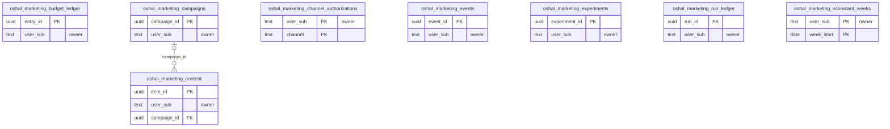

<!-- GENERATED by scripts/generate-schema-docs.js - do not edit by hand; regenerate instead. -->

# Marketing Engine (`marketing-engine`) - database schema

Postgres database `oshal`, schema `public` - shared with the platform and every other installed package. 8 tables in the reference database.

**Migrations** (declared in `oshal-app.yaml`, applied on activation, recorded in `app_package_migrations`): `migrations/001-marketing-core.sql`, `migrations/002-marketing-metrics.sql`

**Created at runtime by package code** (`CREATE TABLE IF NOT EXISTS`): `routes/marketing-ops-routes.js`, `routes/marketing-routes.js`, `src-routes/marketing-ops-routes.ts`, `src-routes/marketing-routes.ts`

Platform conventions (ownership, RLS, how migrations run): [core data model](https://github.com/emeraldcoastsystemsgroup/oshal/blob/main/docs/architecture/data-model/README.md).

The diagram shows key columns only: primary keys (PK), foreign keys (FK), single-column unique keys (UK) and the column an RLS policy scopes rows by ("owner"). A box with no columns is a table documented on another page. Every column is listed under Tables.

## Diagram

## Tables

### `oshal_marketing_budget_ledger`

Defined in `migrations/001-marketing-core.sql`, `routes/marketing-routes.js`, `src-routes/marketing-routes.ts` · RLS **forced** - owner `user_sub`

| Column | Type | Null | Default | Notes |
|---|---|---|---|---|
| `entry_id` | uuid | no | gen_random_uuid() | PK |
| `user_sub` | text | no |  | owner |
| `campaign_id` | uuid | yes |  |  |
| `channel` | text | yes |  |  |
| `field` | text | no |  |  |
| `old_value` | text | yes |  |  |
| `new_value` | text | no |  |  |
| `status` | text | no | 'proposed' |  |
| `proposed_by` | text | no | 'bot' |  |
| `decided_by` | text | yes |  |  |
| `decided_at` | timestamp with time zone | yes |  |  |
| `created_at` | timestamp with time zone | no | now() |  |

### `oshal_marketing_campaigns`

Defined in `migrations/001-marketing-core.sql`, `routes/marketing-routes.js`, `src-routes/marketing-routes.ts` · RLS **forced** - owner `user_sub`

| Column | Type | Null | Default | Notes |
|---|---|---|---|---|
| `campaign_id` | uuid | no | gen_random_uuid() | PK |
| `user_sub` | text | no |  | owner |
| `product` | text | no |  |  |
| `name` | text | no |  |  |
| `slug` | text | no |  |  |
| `motion` | text | no | 'adoption' |  |
| `stage` | integer | no | 0 |  |
| `status` | text | no | 'draft' |  |
| `icp` | jsonb | no | '{}' |  |
| `message_map` | jsonb | no | '{}' |  |
| `channels` | jsonb | no | '[]' |  |
| `budget_monthly_usd` | numeric | no | 0 |  |
| `target_cpa_usd` | numeric | yes |  |  |
| `created_at` | timestamp with time zone | no | now() |  |
| `updated_at` | timestamp with time zone | no | now() |  |

### `oshal_marketing_channel_authorizations`

Defined in `migrations/001-marketing-core.sql`, `routes/marketing-routes.js`, `src-routes/marketing-routes.ts` · RLS **forced** - owner `user_sub`

| Column | Type | Null | Default | Notes |
|---|---|---|---|---|
| `user_sub` | text | no |  | PK · owner |
| `channel` | text | no |  | PK |
| `enabled` | boolean | no | false |  |
| `standing_authorization` | boolean | no | false |  |
| `daily_cap` | integer | no | 0 |  |
| `paused_reason` | text | yes |  |  |
| `updated_at` | timestamp with time zone | no | now() |  |

### `oshal_marketing_content`

Defined in `migrations/001-marketing-core.sql`, `routes/marketing-routes.js`, `src-routes/marketing-routes.ts` · RLS **forced** - owner `user_sub`

| Column | Type | Null | Default | Notes |
|---|---|---|---|---|
| `item_id` | uuid | no | gen_random_uuid() | PK |
| `user_sub` | text | no |  | owner |
| `campaign_id` | uuid | yes |  | FK → [`oshal_marketing_campaigns.campaign_id`](#oshal_marketing_campaigns) |
| `channel` | text | no |  |  |
| `title` | text | no | '' |  |
| `body` | text | no |  |  |
| `status` | text | no | 'draft' |  |
| `utm_url` | text | yes |  |  |
| `published_ref` | text | yes |  |  |
| `created_at` | timestamp with time zone | no | now() |  |
| `updated_at` | timestamp with time zone | no | now() |  |

### `oshal_marketing_events`

Defined in `migrations/002-marketing-metrics.sql`, `routes/marketing-ops-routes.js`, `src-routes/marketing-ops-routes.ts` · RLS **forced** - owner `user_sub`

| Column | Type | Null | Default | Notes |
|---|---|---|---|---|
| `event_id` | uuid | no | gen_random_uuid() | PK |
| `user_sub` | text | no |  | owner |
| `ts` | timestamp with time zone | no |  |  |
| `source` | text | no |  |  |
| `campaign_slug` | text | yes |  |  |
| `medium` | text | yes |  |  |
| `event` | text | no |  |  |
| `value` | numeric | no | 0 |  |
| `meta` | jsonb | no | '{}' |  |

### `oshal_marketing_experiments`

Defined in `migrations/001-marketing-core.sql`, `routes/marketing-routes.js`, `src-routes/marketing-routes.ts` · RLS **forced** - owner `user_sub`

| Column | Type | Null | Default | Notes |
|---|---|---|---|---|
| `experiment_id` | uuid | no | gen_random_uuid() | PK |
| `user_sub` | text | no |  | owner |
| `campaign_id` | uuid | yes |  |  |
| `hypothesis` | text | no |  |  |
| `variable` | text | no |  |  |
| `ice_impact` | integer | no |  |  |
| `ice_confidence` | integer | no |  |  |
| `ice_ease` | integer | no |  |  |
| `status` | text | no | 'proposed' |  |
| `window_start` | date | yes |  |  |
| `window_end` | date | yes |  |  |
| `verdict` | text | yes |  |  |
| `created_at` | timestamp with time zone | no | now() |  |
| `updated_at` | timestamp with time zone | no | now() |  |

### `oshal_marketing_run_ledger`

Defined in `migrations/002-marketing-metrics.sql`, `routes/marketing-ops-routes.js`, `src-routes/marketing-ops-routes.ts` · RLS **forced** - owner `user_sub`

| Column | Type | Null | Default | Notes |
|---|---|---|---|---|
| `run_id` | uuid | no | gen_random_uuid() | PK |
| `user_sub` | text | no |  | owner |
| `channel` | text | no |  |  |
| `action` | text | no |  |  |
| `outcome` | text | no |  |  |
| `detail` | jsonb | no | '{}' |  |
| `ts` | timestamp with time zone | no | now() |  |

### `oshal_marketing_scorecard_weeks`

Defined in `migrations/002-marketing-metrics.sql`, `routes/marketing-ops-routes.js`, `src-routes/marketing-ops-routes.ts` · RLS **forced** - owner `user_sub`

| Column | Type | Null | Default | Notes |
|---|---|---|---|---|
| `user_sub` | text | no |  | PK · owner |
| `week_start` | date | no |  | PK |
| `data` | jsonb | no |  |  |
| `sources` | jsonb | no | '{}' |  |
| `computed_at` | timestamp with time zone | no | now() |  |
