<!-- GENERATED by scripts/generate-schema-docs.js - do not edit by hand; regenerate instead. -->

# Payroll (`payroll`) - database schema

Postgres database `oshal`, schema `public` - shared with the platform and every other installed package. 10 tables in the reference database, 2 declared but not present.

**Migrations:** none declared in `oshal-app.yaml`.

**Created at runtime by package code** (`CREATE TABLE IF NOT EXISTS`): `routes/payroll-schema.js`, `src-routes/payroll-schema.ts`

Platform conventions (ownership, RLS, how migrations run): [core data model](https://github.com/emeraldcoastsystemsgroup/oshal/blob/main/docs/architecture/data-model/README.md).

The diagram shows key columns only: primary keys (PK), foreign keys (FK), single-column unique keys (UK) and the column an RLS policy scopes rows by ("owner"). A box with no columns is a table documented on another page. Every column is listed under Tables.

## Diagram

```mermaid
erDiagram
  payroll_audit {
    bigint audit_id PK
    text user_sub "owner"
  }
  payroll_bank_accounts {
    text account_id PK
    text user_sub "owner"
  }
  payroll_company {
    text user_sub PK "owner"
  }
  payroll_deduction_elections {
    text election_id PK
    text user_sub "owner"
  }
  payroll_employees {
    text employee_id PK
    text user_sub "owner"
  }
  payroll_line_deductions {
    text deduction_id PK
    text user_sub "owner"
  }
  payroll_line_earnings {
    text earning_id PK
    text user_sub "owner"
  }
  payroll_payments {
    text payment_id PK
    text user_sub "owner"
  }
  payroll_run_lines {
    text run_id PK
    text employee_id PK
    text user_sub "owner"
  }
  payroll_runs {
    text run_id PK
    text user_sub "owner"
  }
```

## Tables

### `payroll_audit`

Defined in `routes/payroll-schema.js`, `src-routes/payroll-schema.ts` · RLS **forced** - owner `user_sub`

| Column | Type | Null | Default | Notes |
|---|---|---|---|---|
| `audit_id` | bigint | no | nextval('payroll_audit_audit_id_seq') | PK |
| `user_sub` | text | no |  | owner |
| `entity` | text | no |  |  |
| `entity_id` | text | no |  |  |
| `action` | text | no |  |  |
| `actor` | text | no |  |  |
| `before_json` | jsonb | yes |  |  |
| `after_json` | jsonb | yes |  |  |
| `at` | timestamp with time zone | no | now() |  |

### `payroll_bank_accounts`

Defined in `routes/payroll-schema.js`, `src-routes/payroll-schema.ts` · RLS **forced** - owner `user_sub`

| Column | Type | Null | Default | Notes |
|---|---|---|---|---|
| `account_id` | text | no |  | PK |
| `user_sub` | text | no |  | owner |
| `employee_id` | text | no |  |  |
| `nickname` | text | no | '' |  |
| `routing_encrypted` | text | yes |  |  |
| `routing_last4` | text | no | '' |  |
| `account_encrypted` | text | yes |  |  |
| `account_last4` | text | no | '' |  |
| `account_type` | text | no | 'checking' |  |
| `split_order` | integer | no | 1 |  |
| `split_amount_cents` | bigint | yes |  |  |
| `split_percent` | numeric | yes |  |  |
| `active` | boolean | no | true |  |
| `created_at` | timestamp with time zone | no | now() |  |

### `payroll_company`

Defined in `routes/payroll-schema.js`, `src-routes/payroll-schema.ts` · RLS **forced** - owner `user_sub`

| Column | Type | Null | Default | Notes |
|---|---|---|---|---|
| `user_sub` | text | no |  | PK · owner |
| `company_name` | text | no | 'My Company' |  |
| `pay_frequency` | text | no | 'biweekly' |  |
| `state_code` | text | no | 'FL' |  |
| `suta_rate_pct` | numeric | no | 2.7 |  |
| `suta_wage_base_cents` | bigint | no | 700000 |  |
| `created_at` | timestamp with time zone | no | now() |  |
| `updated_at` | timestamp with time zone | no | now() |  |
| `shift_pay_date` | boolean | no | true |  |
| `futa_credit_reduction_pct` | numeric | no | 0 |  |
| `legal_name` | text | no | '' |  |
| `trade_name` | text | no | '' |  |
| `ein_encrypted` | text | yes |  |  |
| `ein_last4` | text | no | '' |  |
| `address_line1` | text | no | '' |  |
| `address_line2` | text | no | '' |  |
| `city` | text | no | '' |  |
| `postal_code` | text | no | '' |  |
| `state_account_number` | text | no | '' |  |
| `depositor_status` | text | no | 'monthly' |  |
| `workweek_start_day` | integer | no | 0 |  |
| `ach_odfi_routing` | text | no | '' |  |
| `ach_odfi_name` | text | no | '' |  |
| `ach_company_id` | text | no | '' |  |
| `ach_entry_description` | text | no | 'PAYROLL' |  |

### `payroll_deduction_elections`

Defined in `routes/payroll-schema.js`, `src-routes/payroll-schema.ts` · RLS **forced** - owner `user_sub`

| Column | Type | Null | Default | Notes |
|---|---|---|---|---|
| `election_id` | text | no |  | PK |
| `user_sub` | text | no |  | owner |
| `employee_id` | text | no |  |  |
| `code` | text | no |  |  |
| `amount_cents` | bigint | no | 0 |  |
| `percent_of_gross` | numeric | yes |  |  |
| `annual_limit_cents` | bigint | yes |  |  |
| `lifetime_limit_cents` | bigint | yes |  |  |
| `ytd_cents` | bigint | no | 0 |  |
| `lifetime_cents` | bigint | no | 0 |  |
| `arrears_cents` | bigint | no | 0 |  |
| `support_ccpa_pct` | numeric | yes |  |  |
| `payee` | text | no | '' |  |
| `case_number` | text | no | '' |  |
| `effective_from` | date | yes |  |  |
| `effective_to` | date | yes |  |  |
| `active` | boolean | no | true |  |
| `created_at` | timestamp with time zone | no | now() |  |
| `updated_at` | timestamp with time zone | no | now() |  |

### `payroll_employees`

Defined in `routes/payroll-schema.js`, `src-routes/payroll-schema.ts` · RLS **forced** - owner `user_sub`

| Column | Type | Null | Default | Notes |
|---|---|---|---|---|
| `employee_id` | text | no |  | PK |
| `user_sub` | text | no |  | owner |
| `first_name` | text | no |  |  |
| `last_name` | text | no |  |  |
| `email` | text | yes |  |  |
| `comp_type` | text | no | 'hourly' |  |
| `annual_salary_cents` | bigint | no | 0 |  |
| `hourly_rate_cents` | bigint | no | 0 |  |
| `default_hours` | numeric | no | 80 |  |
| `filing_status` | text | no | 'single' |  |
| `w4_step2` | boolean | no | false |  |
| `w4_dependents_credit_cents` | bigint | no | 0 |  |
| `w4_other_income_cents` | bigint | no | 0 |  |
| `w4_deductions_cents` | bigint | no | 0 |  |
| `w4_extra_withholding_cents` | bigint | no | 0 |  |
| `k401_pct` | numeric | no | 0 |  |
| `roth_pct` | numeric | no | 0 |  |
| `health_per_period_cents` | bigint | no | 0 |  |
| `other_posttax_cents` | bigint | no | 0 |  |
| `state_rate_pct` | numeric | no | 0 |  |
| `status` | text | no | 'active' |  |
| `created_at` | timestamp with time zone | no | now() |  |
| `updated_at` | timestamp with time zone | no | now() |  |
| `state_code` | text | no | '' |  |
| `state_allowances` | integer | no | 0 |  |
| `garnishment_cents` | bigint | no | 0 |  |
| `birth_date` | date | yes |  |  |
| `w4_exempt` | boolean | no | false |  |
| `tipped_occupation_code` | text | no | '' |  |
| `hire_date` | date | yes |  |  |
| `termination_date` | date | yes |  |  |
| `prior_ytd_year` | integer | yes |  |  |
| `prior_ytd_taxable_wages_cents` | bigint | no | 0 |  |
| `prior_ytd_ss_taxable_cents` | bigint | no | 0 |  |
| `prior_ytd_deferral_cents` | bigint | no | 0 |  |
| `prior_ytd_supplemental_cents` | bigint | no | 0 |  |
| `prior_ytd_gross_cents` | bigint | no | 0 |  |
| `prior_ytd_fit_cents` | bigint | no | 0 |  |
| `prior_ytd_ss_cents` | bigint | no | 0 |  |
| `prior_ytd_medicare_cents` | bigint | no | 0 |  |
| `prior_ytd_state_cents` | bigint | no | 0 |  |
| `ssn_encrypted` | text | yes |  |  |
| `ssn_last4` | text | no | '' |  |
| `address_line1` | text | no | '' |  |
| `address_line2` | text | no | '' |  |
| `city` | text | no | '' |  |
| `postal_code` | text | no | '' |  |
| `worker_type` | text | no | 'w2' |  |
| `flsa_exempt` | boolean | no | false |  |
| `department` | text | no | '' |  |
| `cost_center` | text | no | '' |  |
| `work_location` | text | no | '' |  |
| `pay_method` | text | no | 'check' |  |
| `pto_balance_hours` | numeric | no | 0 |  |
| `sick_balance_hours` | numeric | no | 0 |  |

### `payroll_line_deductions`

Defined in `routes/payroll-schema.js`, `src-routes/payroll-schema.ts` · RLS **forced** - owner `user_sub`

| Column | Type | Null | Default | Notes |
|---|---|---|---|---|
| `deduction_id` | text | no |  | PK |
| `user_sub` | text | no |  | owner |
| `run_id` | text | no |  |  |
| `employee_id` | text | no |  |  |
| `code` | text | no |  |  |
| `requested_cents` | bigint | no | 0 |  |
| `applied_cents` | bigint | no | 0 |  |
| `arrears_added_cents` | bigint | no | 0 |  |
| `reason` | text | no | '' |  |
| `created_at` | timestamp with time zone | no | now() |  |

### `payroll_line_earnings`

Defined in `routes/payroll-schema.js`, `src-routes/payroll-schema.ts` · RLS **forced** - owner `user_sub`

| Column | Type | Null | Default | Notes |
|---|---|---|---|---|
| `earning_id` | text | no |  | PK |
| `user_sub` | text | no |  | owner |
| `run_id` | text | no |  |  |
| `employee_id` | text | no |  |  |
| `code` | text | no |  |  |
| `hours` | numeric | no | 0 |  |
| `rate_cents` | bigint | no | 0 |  |
| `amount_cents` | bigint | no | 0 |  |
| `workweek` | integer | no | 1 |  |
| `gross_cents` | bigint | no | 0 |  |
| `derived` | boolean | no | false |  |
| `memo` | text | no | '' |  |
| `created_at` | timestamp with time zone | no | now() |  |

### `payroll_payments`

Defined in `routes/payroll-schema.js`, `src-routes/payroll-schema.ts` · RLS **forced** - owner `user_sub`

| Column | Type | Null | Default | Notes |
|---|---|---|---|---|
| `payment_id` | text | no |  | PK |
| `user_sub` | text | no |  | owner |
| `run_id` | text | no |  |  |
| `employee_id` | text | no |  |  |
| `method` | text | no | 'check' |  |
| `amount_cents` | bigint | no | 0 |  |
| `check_number` | text | no | '' |  |
| `bank_account_id` | text | yes |  |  |
| `ach_trace` | text | no | '' |  |
| `status` | text | no | 'pending' |  |
| `issued_on` | date | yes |  |  |
| `cleared_on` | date | yes |  |  |
| `note` | text | no | '' |  |
| `created_at` | timestamp with time zone | no | now() |  |
| `updated_at` | timestamp with time zone | no | now() |  |

### `payroll_run_lines`

Defined in `routes/payroll-schema.js`, `src-routes/payroll-schema.ts` · RLS **forced** - owner `user_sub`

| Column | Type | Null | Default | Notes |
|---|---|---|---|---|
| `run_id` | text | no |  | PK |
| `employee_id` | text | no |  | PK |
| `user_sub` | text | no |  | owner |
| `hours` | numeric | no | 0 |  |
| `ot_hours` | numeric | no | 0 |  |
| `bonus_cents` | bigint | no | 0 |  |
| `reimbursement_cents` | bigint | no | 0 |  |
| `gross_cents` | bigint | no | 0 |  |
| `fit_taxable_cents` | bigint | no | 0 |  |
| `fica_taxable_cents` | bigint | no | 0 |  |
| `ss_taxable_cents` | bigint | no | 0 |  |
| `fit_cents` | bigint | no | 0 |  |
| `ss_cents` | bigint | no | 0 |  |
| `medicare_cents` | bigint | no | 0 |  |
| `addl_medicare_cents` | bigint | no | 0 |  |
| `state_cents` | bigint | no | 0 |  |
| `pretax_cents` | bigint | no | 0 |  |
| `posttax_cents` | bigint | no | 0 |  |
| `net_cents` | bigint | no | 0 |  |
| `er_ss_cents` | bigint | no | 0 |  |
| `er_medicare_cents` | bigint | no | 0 |  |
| `futa_cents` | bigint | no | 0 |  |
| `suta_cents` | bigint | no | 0 |  |
| `computed` | jsonb | yes |  |  |
| `updated_at` | timestamp with time zone | no | now() |  |
| `k401_cents` | bigint | no | 0 |  |
| `health_cents` | bigint | no | 0 |  |
| `roth_cents` | bigint | no | 0 |  |
| `supplemental_fit_cents` | bigint | no | 0 |  |
| `deferral_cents` | bigint | no | 0 |  |
| `tips_cents` | bigint | no | 0 |  |
| `qualified_ot_cents` | bigint | no | 0 |  |
| `garnishment_cents` | bigint | no | 0 |  |
| `disposable_cents` | bigint | no | 0 |  |
| `supplemental_taxable_cents` | bigint | no | 0 |  |
| `prorate_pct` | numeric | no | 100 |  |
| `ot_flsa_qualified` | boolean | no | true |  |
| `bonus_method` | text | no | 'aggregate' |  |
| `warnings` | jsonb | yes |  |  |
| `imputed_cents` | bigint | no | 0 |  |
| `cash_earnings_cents` | bigint | no | 0 |  |
| `nontaxable_paid_cents` | bigint | no | 0 |  |
| `bonus_is_discretionary` | boolean | no | false |  |
| `workweek_hours` | jsonb | yes |  |  |
| `uses_earning_rows` | boolean | no | false |  |

### `payroll_runs`

Defined in `routes/payroll-schema.js`, `src-routes/payroll-schema.ts` · RLS **forced** - owner `user_sub`

| Column | Type | Null | Default | Notes |
|---|---|---|---|---|
| `run_id` | text | no |  | PK |
| `user_sub` | text | no |  | owner |
| `period_start` | date | no |  |  |
| `period_end` | date | no |  |  |
| `pay_date` | date | no |  |  |
| `pay_frequency` | text | no |  |  |
| `status` | text | no | 'draft' |  |
| `created_at` | timestamp with time zone | no | now() |  |
| `updated_at` | timestamp with time zone | no | now() |  |
| `kind` | text | no | 'regular' |  |
| `corrects_run_id` | text | yes |  |  |
| `approved_by` | text | yes |  |  |
| `approved_at` | timestamp with time zone | yes |  |  |
| `note` | text | yes |  |  |
| `suppress_voluntary` | boolean | no | false |  |

## Declared in source, not present in the reference database

These tables have a `CREATE TABLE` in source but are not in the reference database. Columns are parsed from the statement as written; later `ALTER TABLE` changes are not applied.

### `payroll_ach_events`

Defined in `routes/payroll-schema.js`, `src-routes/payroll-schema.ts`

| Column | Type | Null | Default | Notes |
|---|---|---|---|---|
| `event_id` | TEXT | no |  | PK |
| `user_sub` | TEXT | no |  |  |
| `kind` | TEXT | no |  |  |
| `code` | TEXT | no |  |  |
| `original_trace` | TEXT | no | '' |  |
| `return_trace` | TEXT | no | '' |  |
| `amount_cents` | BIGINT | no | 0 |  |
| `individual_name` | TEXT | no | '' |  |
| `payment_id` | TEXT | yes |  |  |
| `employee_id` | TEXT | yes |  |  |
| `applied` | BOOLEAN | no | false |  |
| `detail` | JSONB | yes |  |  |
| `imported_at` | TIMESTAMPTZ | no | now() |  |

### `payroll_filings`

Defined in `routes/payroll-schema.js`, `src-routes/payroll-schema.ts`

| Column | Type | Null | Default | Notes |
|---|---|---|---|---|
| `filing_id` | TEXT | no |  | PK |
| `user_sub` | TEXT | no |  |  |
| `kind` | TEXT | no |  |  |
| `period` | TEXT | no |  |  |
| `totals` | JSONB | yes |  |  |
| `note` | TEXT | no | '' |  |
| `produced_by` | TEXT | no | '' |  |
| `produced_at` | TIMESTAMPTZ | no | now() |  |
