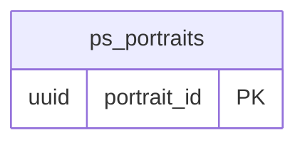

<!-- GENERATED by scripts/generate-schema-docs.js - do not edit by hand; regenerate instead. -->

# Portrait Studio (`portrait-studio`) - database schema

Postgres database `oshal`, schema `public` - shared with the platform and every other installed package. 1 table in the reference database.

**Migrations** (declared in `oshal-app.yaml`, applied on activation, recorded in `app_package_migrations`): `migrations/001-portrait-studio.sql`, `migrations/002-cost-and-resilience.sql`

**Created at runtime by package code** (`CREATE TABLE IF NOT EXISTS`): `routes/portrait-studio-routes.js`, `src-routes/portrait-studio-routes.ts`

Platform conventions (ownership, RLS, how migrations run): [core data model](https://github.com/emeraldcoastsystemsgroup/oshal/blob/main/docs/architecture/data-model/README.md).

The diagram shows key columns only: primary keys (PK), foreign keys (FK), single-column unique keys (UK) and the column an RLS policy scopes rows by ("owner"). A box with no columns is a table documented on another page. Every column is listed under Tables.

## Diagram

## Tables

### `ps_portraits`

Defined in `migrations/001-portrait-studio.sql`, `routes/portrait-studio-routes.js`, `src-routes/portrait-studio-routes.ts` · RLS **off**

| Column | Type | Null | Default | Notes |
|---|---|---|---|---|
| `portrait_id` | uuid | no | gen_random_uuid() | PK |
| `user_sub` | text | no |  |  |
| `mode` | character varying(20) | no | 'professional' |  |
| `style` | text | no |  |  |
| `options` | jsonb | no | '{}' |  |
| `prompt` | text | yes |  |  |
| `status` | character varying(16) | no | 'queued' |  |
| `source_path` | text | yes |  |  |
| `original_path` | text | yes |  |  |
| `output_path` | text | yes |  |  |
| `model` | text | yes |  |  |
| `error` | text | yes |  |  |
| `created_at` | timestamp with time zone | no | now() |  |
| `updated_at` | timestamp with time zone | no | now() |  |
| `cost_usd` | numeric(12,6) | yes |  |  |
