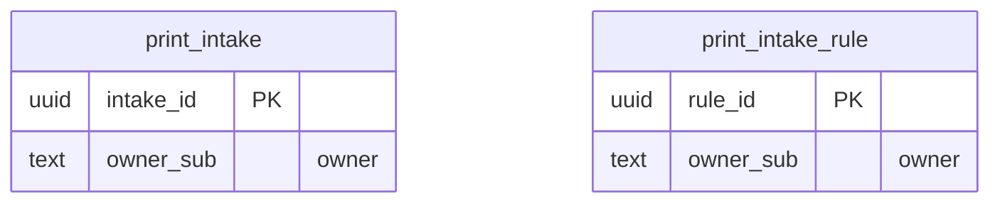

<!-- GENERATED by scripts/generate-schema-docs.js - do not edit by hand; regenerate instead. -->

# Print Ingest (`print-ingest`) - database schema

Postgres database `oshal`, schema `public` - shared with the platform and every other installed package. 2 tables in the reference database.

**Migrations** (declared in `oshal-app.yaml`, applied on activation, recorded in `app_package_migrations`): `migrations/001-print-ingest.sql`

Platform conventions (ownership, RLS, how migrations run): [core data model](https://github.com/emeraldcoastsystemsgroup/oshal/blob/main/docs/architecture/data-model/README.md).

The diagram shows key columns only: primary keys (PK), foreign keys (FK), single-column unique keys (UK) and the column an RLS policy scopes rows by ("owner"). A box with no columns is a table documented on another page. Every column is listed under Tables.

## Diagram

## Tables

### `print_intake`

Defined in `migrations/001-print-ingest.sql` · RLS **forced** - owner `owner_sub`

| Column | Type | Null | Default | Notes |
|---|---|---|---|---|
| `intake_id` | uuid | no | gen_random_uuid() | PK |
| `owner_sub` | text | no |  | owner |
| `content_sha256` | text | no |  |  |
| `title` | text | no |  |  |
| `text_chars` | integer | no | 0 |  |
| `text_body` | text | yes |  |  |
| `sidecar` | jsonb | no | '{}' |  |
| `recommendation` | jsonb | no | '{}' |  |
| `approved_destinations` | jsonb | no | '[]' |  |
| `fanout` | jsonb | no | '[]' |  |
| `state` | text | no | 'awaiting_approval' |  |
| `failure_reason` | text | yes |  |  |
| `applied_rule_id` | uuid | yes |  |  |
| `ticket_id` | text | yes |  |  |
| `created_at` | timestamp with time zone | no | now() |  |
| `decided_at` | timestamp with time zone | yes |  |  |
| `decided_by` | text | yes |  |  |

### `print_intake_rule`

Defined in `migrations/001-print-ingest.sql` · RLS **forced** - owner `owner_sub`

| Column | Type | Null | Default | Notes |
|---|---|---|---|---|
| `rule_id` | uuid | no | gen_random_uuid() | PK |
| `owner_sub` | text | no |  | owner |
| `label` | text | no |  |  |
| `match_client_ip` | text | yes |  |  |
| `match_computer` | text | yes |  |  |
| `match_printer` | text | yes |  |  |
| `suggested_user_sub` | text | yes |  |  |
| `destinations` | jsonb | no | '[]' |  |
| `auto_approve` | boolean | no | false |  |
| `enabled` | boolean | no | true |  |
| `created_at` | timestamp with time zone | no | now() |  |
