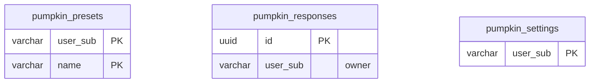

<!-- GENERATED by scripts/generate-schema-docs.js - do not edit by hand; regenerate instead. -->

# Pumpkin (`pumpkin`) - database schema

Postgres database `oshal`, schema `public` - shared with the platform and every other installed package. 3 tables in the reference database.

**Migrations** (declared in `oshal-app.yaml`, applied on activation, recorded in `app_package_migrations`): `migrations/084-pumpkin-platform.sql`, `migrations/094-pumpkin-responses.sql`, `migrations/104-pumpkin-room-label.sql`

**Created at runtime by package code** (`CREATE TABLE IF NOT EXISTS`): `routes/pumpkin-engine-preset-service.js`, `routes/pumpkin-engine-response-store.js`, `src-routes/pumpkin-engine-preset-service.ts`, `src-routes/pumpkin-engine-response-store.ts`

Platform conventions (ownership, RLS, how migrations run): [core data model](https://github.com/emeraldcoastsystemsgroup/oshal/blob/main/docs/architecture/data-model/README.md).

The diagram shows key columns only: primary keys (PK), foreign keys (FK), single-column unique keys (UK) and the column an RLS policy scopes rows by ("owner"). A box with no columns is a table documented on another page. Every column is listed under Tables.

## Diagram

## Tables

### `pumpkin_presets`

Defined in `migrations/084-pumpkin-platform.sql`, `routes/pumpkin-engine-preset-service.js`, `src-routes/pumpkin-engine-preset-service.ts` · RLS **off**

Also declared by core (`scripts/migrations/084-pumpkin-platform.sql`).

| Column | Type | Null | Default | Notes |
|---|---|---|---|---|
| `user_sub` | character varying(255) | no |  | PK |
| `name` | character varying(64) | no |  | PK |
| `config` | jsonb | no |  |  |
| `created_at` | timestamp with time zone | no | now() |  |
| `updated_at` | timestamp with time zone | no | now() |  |

### `pumpkin_responses`

Defined in `migrations/094-pumpkin-responses.sql`, `routes/pumpkin-engine-response-store.js`, `src-routes/pumpkin-engine-response-store.ts` · RLS **forced** - owner `user_sub`

| Column | Type | Null | Default | Notes |
|---|---|---|---|---|
| `id` | uuid | no | gen_random_uuid() | PK |
| `user_sub` | character varying(255) | no |  | owner |
| `say` | text | no |  |  |
| `expression` | character varying(16) | no | 'neutral' |  |
| `intensity` | real | no | 0.6 |  |
| `source` | character varying(16) | no | 'manual' |  |
| `pinned` | boolean | no | false |  |
| `play_count` | integer | no | 0 |  |
| `last_played_at` | timestamp with time zone | yes |  |  |
| `created_at` | timestamp with time zone | no | now() |  |
| `updated_at` | timestamp with time zone | no | now() |  |

### `pumpkin_settings`

Defined in `migrations/084-pumpkin-platform.sql`, `routes/pumpkin-engine-preset-service.js`, `src-routes/pumpkin-engine-preset-service.ts` · RLS **off**

Also declared by core (`scripts/migrations/084-pumpkin-platform.sql`).

| Column | Type | Null | Default | Notes |
|---|---|---|---|---|
| `user_sub` | character varying(255) | no |  | PK |
| `active_preset` | character varying(64) | no | 'inflatable' |  |
| `mode` | character varying(16) | no | 'mimic' |  |
| `updated_at` | timestamp with time zone | no | now() |  |
| `room_label` | character varying(40) | no | 'Main' |  |
