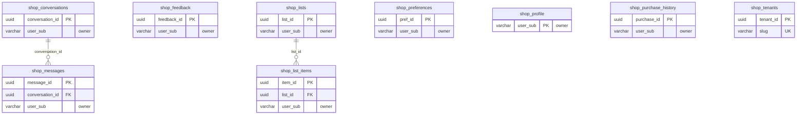

<!-- GENERATED by scripts/generate-schema-docs.js - do not edit by hand; regenerate instead. -->

# Shopping (`purchasing`) - database schema

Postgres database `oshal`, schema `public` - shared with the platform and every other installed package. 9 tables in the reference database.

**Migrations** (declared in `oshal-app.yaml`, applied on activation, recorded in `app_package_migrations`): `migrations/035-purchasing-platform.sql`, `migrations/037-purchasing-chat-memory.sql`, `migrations/038-purchasing-profile.sql`

**Created at runtime by package code** (`CREATE TABLE IF NOT EXISTS`): `routes/purchasing-routes.js`, `src-routes/purchasing-routes.ts`

Platform conventions (ownership, RLS, how migrations run): [core data model](https://github.com/emeraldcoastsystemsgroup/oshal/blob/main/docs/architecture/data-model/README.md).

The diagram shows key columns only: primary keys (PK), foreign keys (FK), single-column unique keys (UK) and the column an RLS policy scopes rows by ("owner"). A box with no columns is a table documented on another page. Every column is listed under Tables.

## Diagram

## Tables

### `shop_conversations`

Defined in `migrations/037-purchasing-chat-memory.sql`, `routes/purchasing-routes.js`, `src-routes/purchasing-routes.ts` · RLS **forced** - owner `user_sub`

| Column | Type | Null | Default | Notes |
|---|---|---|---|---|
| `conversation_id` | uuid | no | gen_random_uuid() | PK |
| `user_sub` | character varying(255) | no |  | owner |
| `title` | text | yes |  |  |
| `created_at` | timestamp with time zone | no | now() |  |
| `updated_at` | timestamp with time zone | no | now() |  |

### `shop_feedback`

Defined in `migrations/037-purchasing-chat-memory.sql`, `routes/purchasing-routes.js`, `src-routes/purchasing-routes.ts` · RLS **forced** - owner `user_sub`

| Column | Type | Null | Default | Notes |
|---|---|---|---|---|
| `feedback_id` | uuid | no | gen_random_uuid() | PK |
| `tenant_id` | uuid | no | '00000000-0000-4000-8000-00000000c001' |  |
| `user_sub` | character varying(255) | no |  | owner |
| `note` | text | no |  |  |
| `source` | character varying(20) | no | 'chat' |  |
| `created_at` | timestamp with time zone | no | now() |  |

### `shop_list_items`

Defined in `migrations/035-purchasing-platform.sql`, `routes/purchasing-routes.js`, `src-routes/purchasing-routes.ts` · RLS **forced** - owner `user_sub`

| Column | Type | Null | Default | Notes |
|---|---|---|---|---|
| `item_id` | uuid | no | gen_random_uuid() | PK |
| `list_id` | uuid | no |  | FK → [`shop_lists.list_id`](#shop_lists) |
| `user_sub` | character varying(255) | no |  | owner |
| `retailer` | character varying(40) | no | 'walmart' |  |
| `product_id` | character varying(128) | yes |  |  |
| `title` | text | yes |  |  |
| `brand` | text | yes |  |  |
| `image_url` | text | yes |  |  |
| `product_url` | text | yes |  |  |
| `quantity` | integer | no | 1 |  |
| `unit_price` | numeric(10,2) | yes |  |  |
| `reason` | text | yes |  |  |
| `status` | character varying(20) | no | 'pending' |  |
| `created_at` | timestamp with time zone | no | now() |  |

### `shop_lists`

Defined in `migrations/035-purchasing-platform.sql`, `routes/purchasing-routes.js`, `src-routes/purchasing-routes.ts` · RLS **forced** - owner `user_sub`

| Column | Type | Null | Default | Notes |
|---|---|---|---|---|
| `list_id` | uuid | no | gen_random_uuid() | PK |
| `tenant_id` | uuid | no | '00000000-0000-4000-8000-00000000c001' |  |
| `user_sub` | character varying(255) | no |  | owner |
| `name` | text | no | 'My List' |  |
| `status` | character varying(20) | no | 'active' |  |
| `created_at` | timestamp with time zone | no | now() |  |
| `updated_at` | timestamp with time zone | no | now() |  |

### `shop_messages`

Defined in `migrations/037-purchasing-chat-memory.sql`, `routes/purchasing-routes.js`, `src-routes/purchasing-routes.ts` · RLS **forced** - owner `user_sub`

| Column | Type | Null | Default | Notes |
|---|---|---|---|---|
| `message_id` | uuid | no | gen_random_uuid() | PK |
| `conversation_id` | uuid | no |  | FK → [`shop_conversations.conversation_id`](#shop_conversations) |
| `user_sub` | character varying(255) | no |  | owner |
| `role` | character varying(16) | no |  |  |
| `content` | text | no |  |  |
| `created_at` | timestamp with time zone | no | now() |  |

### `shop_preferences`

Defined in `migrations/035-purchasing-platform.sql`, `routes/purchasing-routes.js`, `src-routes/purchasing-routes.ts` · RLS **forced** - owner `user_sub`

| Column | Type | Null | Default | Notes |
|---|---|---|---|---|
| `pref_id` | uuid | no | gen_random_uuid() | PK |
| `tenant_id` | uuid | no | '00000000-0000-4000-8000-00000000c001' |  |
| `user_sub` | character varying(255) | no |  | owner |
| `item_key` | character varying(160) | no |  |  |
| `retailer` | character varying(40) | yes |  |  |
| `product_id` | character varying(128) | yes |  |  |
| `title` | text | yes |  |  |
| `brand` | text | yes |  |  |
| `last_quantity` | integer | yes | 1 |  |
| `last_unit_price` | numeric(10,2) | yes |  |  |
| `buy_count` | integer | no | 1 |  |
| `reason` | text | yes |  |  |
| `updated_at` | timestamp with time zone | no | now() |  |

### `shop_profile`

Defined in `migrations/038-purchasing-profile.sql`, `routes/purchasing-routes.js`, `src-routes/purchasing-routes.ts` · RLS **forced** - owner `user_sub`

| Column | Type | Null | Default | Notes |
|---|---|---|---|---|
| `user_sub` | character varying(255) | no |  | PK · owner |
| `tenant_id` | uuid | no | '00000000-0000-4000-8000-00000000c001' |  |
| `display_name` | text | yes |  |  |
| `household_size` | integer | yes |  |  |
| `dietary` | text[] | no | '{}' |  |
| `brands_love` | text[] | no | '{}' |  |
| `brands_avoid` | text[] | no | '{}' |  |
| `preferred_retailer` | character varying(40) | no | 'walmart' |  |
| `preferred_store` | text | yes |  |  |
| `budget_monthly` | numeric(10,2) | yes |  |  |
| `notes` | text | yes |  |  |
| `onboarded` | boolean | no | false |  |
| `created_at` | timestamp with time zone | no | now() |  |
| `updated_at` | timestamp with time zone | no | now() |  |

### `shop_purchase_history`

Defined in `migrations/035-purchasing-platform.sql`, `routes/purchasing-routes.js`, `src-routes/purchasing-routes.ts` · RLS **forced** - owner `user_sub`

| Column | Type | Null | Default | Notes |
|---|---|---|---|---|
| `purchase_id` | uuid | no | gen_random_uuid() | PK |
| `user_sub` | character varying(255) | no |  | owner |
| `retailer` | character varying(40) | yes |  |  |
| `order_ref` | character varying(255) | yes |  |  |
| `items` | jsonb | no | '[]' |  |
| `total` | numeric(10,2) | yes |  |  |
| `handoff_url` | text | yes |  |  |
| `created_at` | timestamp with time zone | no | now() |  |

### `shop_tenants`

Defined in `migrations/035-purchasing-platform.sql` · RLS **forced** - custom policy `shop_tenants_tenant_member`

| Column | Type | Null | Default | Notes |
|---|---|---|---|---|
| `tenant_id` | uuid | no | gen_random_uuid() | PK |
| `slug` | character varying(64) | no |  | UK |
| `name` | text | no |  |  |
| `created_at` | timestamp with time zone | no | now() |  |
