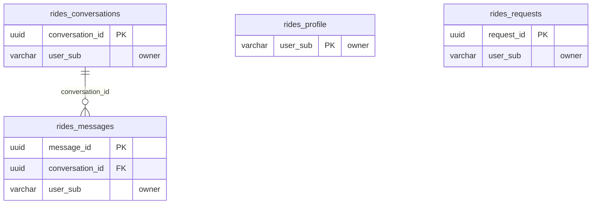

<!-- GENERATED by scripts/generate-schema-docs.js - do not edit by hand; regenerate instead. -->

# Get a Ride (`rides`) - database schema

Postgres database `oshal`, schema `public` - shared with the platform and every other installed package. 4 tables in the reference database.

**Migrations** (declared in `oshal-app.yaml`, applied on activation, recorded in `app_package_migrations`): `migrations/042-rides-platform.sql`

**Created at runtime by package code** (`CREATE TABLE IF NOT EXISTS`): `routes/rides-routes.js`, `src-routes/rides-routes.ts`

Platform conventions (ownership, RLS, how migrations run): [core data model](https://github.com/emeraldcoastsystemsgroup/oshal/blob/main/docs/architecture/data-model/README.md).

The diagram shows key columns only: primary keys (PK), foreign keys (FK), single-column unique keys (UK) and the column an RLS policy scopes rows by ("owner"). A box with no columns is a table documented on another page. Every column is listed under Tables.

## Diagram

## Tables

### `rides_conversations`

Defined in `migrations/042-rides-platform.sql`, `routes/rides-routes.js`, `src-routes/rides-routes.ts` · RLS **forced** - owner `user_sub`

| Column | Type | Null | Default | Notes |
|---|---|---|---|---|
| `conversation_id` | uuid | no | gen_random_uuid() | PK |
| `user_sub` | character varying(255) | no |  | owner |
| `title` | text | yes |  |  |
| `created_at` | timestamp with time zone | no | now() |  |
| `updated_at` | timestamp with time zone | no | now() |  |

### `rides_messages`

Defined in `migrations/042-rides-platform.sql`, `routes/rides-routes.js`, `src-routes/rides-routes.ts` · RLS **forced** - owner `user_sub`

| Column | Type | Null | Default | Notes |
|---|---|---|---|---|
| `message_id` | uuid | no | gen_random_uuid() | PK |
| `conversation_id` | uuid | no |  | FK → [`rides_conversations.conversation_id`](#rides_conversations) |
| `user_sub` | character varying(255) | no |  | owner |
| `role` | character varying(16) | no |  |  |
| `content` | text | no |  |  |
| `created_at` | timestamp with time zone | no | now() |  |

### `rides_profile`

Defined in `migrations/042-rides-platform.sql`, `routes/rides-routes.js`, `src-routes/rides-routes.ts` · RLS **forced** - owner `user_sub`

| Column | Type | Null | Default | Notes |
|---|---|---|---|---|
| `user_sub` | character varying(255) | no |  | PK · owner |
| `tenant_id` | uuid | no | '00000000-0000-4000-8000-00000000c001' |  |
| `display_name` | text | yes |  |  |
| `home_address` | text | yes |  |  |
| `work_address` | text | yes |  |  |
| `default_ride_type` | character varying(20) | yes |  |  |
| `notes` | text | yes |  |  |
| `onboarded` | boolean | no | false |  |
| `created_at` | timestamp with time zone | no | now() |  |
| `updated_at` | timestamp with time zone | no | now() |  |

### `rides_requests`

Defined in `migrations/042-rides-platform.sql`, `routes/rides-routes.js`, `src-routes/rides-routes.ts` · RLS **forced** - owner `user_sub`

| Column | Type | Null | Default | Notes |
|---|---|---|---|---|
| `request_id` | uuid | no | gen_random_uuid() | PK |
| `user_sub` | character varying(255) | no |  | owner |
| `pickup` | text | yes |  |  |
| `dropoff` | text | yes |  |  |
| `ride_type` | character varying(20) | yes |  |  |
| `est_fare_low` | numeric(10,2) | yes |  |  |
| `est_fare_high` | numeric(10,2) | yes |  |  |
| `deep_link` | text | yes |  |  |
| `created_at` | timestamp with time zone | no | now() |  |
