<!-- GENERATED by scripts/generate-schema-docs.js - do not edit by hand; regenerate instead. -->

# Sports Edge (`sports-edge`) - database schema

Postgres database `oshal`, schema `public` - shared with the platform and every other installed package. 10 tables in the reference database.

**Migrations** (declared in `oshal-app.yaml`, applied on activation, recorded in `app_package_migrations`): `migrations/001-sports-edge.sql`, `migrations/002-sports-fantasy.sql`, `migrations/003-sports-line-history.sql`, `migrations/004-sports-world-subjects.sql`

**Created at runtime by package code** (`CREATE TABLE IF NOT EXISTS`): `routes/sports-fantasy-store.js`, `routes/sports-line-store.js`, `routes/sports-store.js`, `src-routes/sports-fantasy-store.ts`, `src-routes/sports-line-store.ts`, `src-routes/sports-store.ts`

Platform conventions (ownership, RLS, how migrations run): [core data model](https://github.com/emeraldcoastsystemsgroup/oshal/blob/main/docs/architecture/data-model/README.md).

The diagram shows key columns only: primary keys (PK), foreign keys (FK), single-column unique keys (UK) and the column an RLS policy scopes rows by ("owner"). A box with no columns is a table documented on another page. Every column is listed under Tables.

## Diagram

```mermaid
erDiagram
  sports_fantasy_calls {
    bigint id PK
  }
  sports_fantasy_leagues {
    bigint id PK
  }
  sports_fantasy_projections {
    integer season PK
    integer scoring_period PK
  }
  sports_followed_teams {
    bigint id PK
  }
  sports_line_history {
    bigint id PK
  }
  sports_predictions {
    bigint id PK
  }
  sports_previews {
    text event_id PK
  }
  sports_ratings_cache {
    text league PK
    integer season PK
  }
  sports_settings {
    text scope_key PK
  }
  sports_world_pulls {
    text entity PK
  }
```

## Tables

### `sports_fantasy_calls`

Defined in `migrations/002-sports-fantasy.sql`, `routes/sports-fantasy-store.js`, `src-routes/sports-fantasy-store.ts` · RLS **off**

| Column | Type | Null | Default | Notes |
|---|---|---|---|---|
| `id` | bigint | no | nextval('sports_fantasy_calls_id_seq') | PK |
| `user_sub` | text | no |  |  |
| `season` | integer | no |  |  |
| `league_id` | text | no |  |  |
| `week` | integer | no |  |  |
| `start_player_id` | integer | no |  |  |
| `start_player_name` | text | yes |  |  |
| `sit_player_id` | integer | no |  |  |
| `sit_player_name` | text | yes |  |  |
| `slot_id` | integer | yes |  |  |
| `projected_start` | numeric(7,2) | yes |  |  |
| `projected_sit` | numeric(7,2) | yes |  |  |
| `projected_gain` | numeric(7,2) | no |  |  |
| `reason` | text | yes |  |  |
| `settled` | boolean | no | false |  |
| `actual_start` | numeric(7,2) | yes |  |  |
| `actual_sit` | numeric(7,2) | yes |  |  |
| `actual_gain` | numeric(7,2) | yes |  |  |
| `graded_at` | timestamp with time zone | yes |  |  |
| `created_at` | timestamp with time zone | no | now() |  |

### `sports_fantasy_leagues`

Defined in `migrations/002-sports-fantasy.sql`, `routes/sports-fantasy-store.js`, `src-routes/sports-fantasy-store.ts` · RLS **off**

| Column | Type | Null | Default | Notes |
|---|---|---|---|---|
| `id` | bigint | no | nextval('sports_fantasy_leagues_id_seq') | PK |
| `user_sub` | text | no |  |  |
| `season` | integer | no |  |  |
| `league_id` | text | no |  |  |
| `league_name` | text | yes |  |  |
| `team_id` | integer | yes |  |  |
| `team_name` | text | yes |  |  |
| `linked_at` | timestamp with time zone | no | now() |  |

### `sports_fantasy_projections`

Defined in `migrations/002-sports-fantasy.sql`, `routes/sports-fantasy-store.js`, `src-routes/sports-fantasy-store.ts` · RLS **off**

| Column | Type | Null | Default | Notes |
|---|---|---|---|---|
| `season` | integer | no |  | PK |
| `scoring_period` | integer | no |  | PK |
| `payload` | jsonb | no |  |  |
| `players` | integer | no | 0 |  |
| `generated_at` | timestamp with time zone | no | now() |  |
| `build_ms` | integer | yes |  |  |

### `sports_followed_teams`

Defined in `migrations/001-sports-edge.sql`, `routes/sports-store.js`, `src-routes/sports-store.ts` · RLS **off**

| Column | Type | Null | Default | Notes |
|---|---|---|---|---|
| `id` | bigint | no | nextval('sports_followed_teams_id_seq') | PK |
| `user_sub` | text | no |  |  |
| `league` | text | no |  |  |
| `team` | text | no |  |  |
| `team_id` | text | no |  |  |
| `display_name` | text | yes |  |  |
| `created_at` | timestamp with time zone | no | now() |  |

### `sports_line_history`

Defined in `migrations/003-sports-line-history.sql`, `routes/sports-line-store.js`, `src-routes/sports-line-store.ts` · RLS **off**

| Column | Type | Null | Default | Notes |
|---|---|---|---|---|
| `id` | bigint | no | nextval('sports_line_history_id_seq') | PK |
| `league` | text | no |  |  |
| `event_id` | text | no |  |  |
| `game_date` | timestamp with time zone | yes |  |  |
| `home_team` | text | no |  |  |
| `away_team` | text | no |  |  |
| `book` | text | no |  |  |
| `home_spread` | numeric(5,1) | yes |  |  |
| `home_spread_odds` | integer | yes |  |  |
| `away_spread_odds` | integer | yes |  |  |
| `home_moneyline` | integer | yes |  |  |
| `away_moneyline` | integer | yes |  |  |
| `total` | numeric(5,1) | yes |  |  |
| `first_seen` | timestamp with time zone | no | now() |  |
| `last_seen` | timestamp with time zone | no | now() |  |
| `observations` | integer | no | 1 |  |

### `sports_predictions`

Defined in `migrations/001-sports-edge.sql`, `routes/sports-store.js`, `src-routes/sports-store.ts` · RLS **off**

| Column | Type | Null | Default | Notes |
|---|---|---|---|---|
| `id` | bigint | no | nextval('sports_predictions_id_seq') | PK |
| `strategy` | text | no |  |  |
| `league` | text | no |  |  |
| `event_id` | text | no |  |  |
| `game_date` | timestamp with time zone | yes |  |  |
| `home_team` | text | no |  |  |
| `away_team` | text | no |  |  |
| `market` | text | no |  |  |
| `side` | text | no |  |  |
| `selection` | text | no |  |  |
| `model_prob` | numeric(6,5) | no |  |  |
| `market_prob` | numeric(6,5) | no |  |  |
| `edge` | numeric(7,5) | no |  |  |
| `price_at_pick` | integer | yes |  |  |
| `spread_at_pick` | numeric(5,1) | yes |  |  |
| `stake_fraction` | numeric(6,5) | no | 0 |  |
| `projected_margin` | numeric(6,2) | yes |  |  |
| `rationale` | jsonb | yes |  |  |
| `user_sub` | text | yes |  |  |
| `settled` | boolean | no | false |  |
| `home_score` | integer | yes |  |  |
| `away_score` | integer | yes |  |  |
| `won` | boolean | yes |  |  |
| `brier` | numeric(8,6) | yes |  |  |
| `market_brier` | numeric(8,6) | yes |  |  |
| `closing_price` | integer | yes |  |  |
| `closing_spread` | numeric(5,1) | yes |  |  |
| `clv` | numeric(8,6) | yes |  |  |
| `pnl_units` | numeric(8,4) | yes |  |  |
| `graded_at` | timestamp with time zone | yes |  |  |
| `created_at` | timestamp with time zone | no | now() |  |

### `sports_previews`

Defined in `migrations/001-sports-edge.sql`, `routes/sports-store.js`, `src-routes/sports-store.ts` · RLS **off**

| Column | Type | Null | Default | Notes |
|---|---|---|---|---|
| `event_id` | text | no |  | PK |
| `league` | text | no |  |  |
| `game_date` | timestamp with time zone | yes |  |  |
| `home_team` | text | no |  |  |
| `away_team` | text | no |  |  |
| `payload` | jsonb | no |  |  |
| `generated_at` | timestamp with time zone | no | now() |  |

### `sports_ratings_cache`

Defined in `migrations/001-sports-edge.sql`, `routes/sports-store.js`, `src-routes/sports-store.ts` · RLS **off**

| Column | Type | Null | Default | Notes |
|---|---|---|---|---|
| `league` | text | no |  | PK |
| `season` | integer | no |  | PK |
| `payload` | jsonb | no |  |  |
| `games` | integer | no | 0 |  |
| `generated_at` | timestamp with time zone | no | now() |  |
| `build_ms` | integer | yes |  |  |

### `sports_settings`

Defined in `migrations/001-sports-edge.sql`, `routes/sports-store.js`, `src-routes/sports-store.ts` · RLS **off**

| Column | Type | Null | Default | Notes |
|---|---|---|---|---|
| `scope_key` | text | no |  | PK |
| `settings` | jsonb | no | '{}' |  |
| `updated_at` | timestamp with time zone | no | now() |  |

### `sports_world_pulls`

Defined in `migrations/004-sports-world-subjects.sql`, `routes/sports-store.js`, `src-routes/sports-store.ts` · RLS **off**

| Column | Type | Null | Default | Notes |
|---|---|---|---|---|
| `entity` | text | no |  | PK |
| `label` | text | no |  |  |
| `kind` | text | no |  |  |
| `last_pulled` | timestamp with time zone | no | now() |  |
| `pulls` | integer | no | 1 |  |
| `last_fetched` | integer | no | 0 |  |
| `last_new` | integer | no | 0 |  |
| `last_error` | text | yes |  |  |
