<!-- GENERATED by scripts/generate-schema-docs.js - do not edit by hand; regenerate instead. -->

# Switchboard (`switchboard`) - database schema

Postgres database `oshal`, schema `public` - shared with the platform and every other installed package. 7 tables in the reference database.

**Migrations** (declared in `oshal-app.yaml`, applied on activation, recorded in `app_package_migrations`): `migrations/001-switchboard-reply-outbox.sql`, `migrations/002-switchboard-stream-posts.sql`

**Created at runtime by package code** (`CREATE TABLE IF NOT EXISTS`): `routes/switchboard-calendar-routes.js`, `routes/switchboard-reply-outbox-routes.js`, `routes/switchboard-routes.js`, `routes/switchboard-streams-routes.js`, `src-routes/switchboard-calendar-routes.ts`, `src-routes/switchboard-reply-outbox-routes.ts`, `src-routes/switchboard-routes.ts`, `src-routes/switchboard-streams-routes.ts`

Platform conventions (ownership, RLS, how migrations run): [core data model](https://github.com/emeraldcoastsystemsgroup/oshal/blob/main/docs/architecture/data-model/README.md).

The diagram shows key columns only: primary keys (PK), foreign keys (FK), single-column unique keys (UK) and the column an RLS policy scopes rows by ("owner"). A box with no columns is a table documented on another page. Every column is listed under Tables.

## Diagram

```mermaid
erDiagram
  oshal_switchboard_reply_outbox {
    uuid reply_id PK
    text user_sub "owner"
  }
  oshal_switchboard_scheduled_posts {
    uuid post_id PK
    text user_sub "owner"
  }
  oshal_switchboard_stream_posts {
    uuid post_id PK
    text user_sub "owner"
  }
  oshal_switchboard_stream_revisions {
    uuid revision_id PK
    text user_sub "owner"
  }
  oshal_switchboard_stream_variants {
    uuid post_id PK
    text user_sub "owner"
    text platform PK
  }
  oshal_switchboard_workspace_accounts {
    uuid workspace_id PK
    text user_sub "owner"
    uuid connection_id PK
  }
  oshal_switchboard_workspaces {
    uuid workspace_id PK
    text user_sub "owner"
  }
```

## Tables

### `oshal_switchboard_reply_outbox`

Defined in `migrations/001-switchboard-reply-outbox.sql`, `routes/switchboard-reply-outbox-routes.js`, `src-routes/switchboard-reply-outbox-routes.ts` · RLS **forced** - owner `user_sub`

| Column | Type | Null | Default | Notes |
|---|---|---|---|---|
| `reply_id` | uuid | no | gen_random_uuid() | PK |
| `user_sub` | text | no |  | owner |
| `idempotency_key` | text | no |  |  |
| `request_hash` | character(64) | no |  |  |
| `provider` | text | no |  |  |
| `source_message_id_ciphertext` | text | no |  |  |
| `recipient_ciphertext` | text | no |  |  |
| `subject_ciphertext` | text | no |  |  |
| `body_ciphertext` | text | no |  |  |
| `workspace_id` | uuid | yes |  |  |
| `status` | text | no | 'pending' |  |
| `attempt_count` | integer | no | 0 |  |
| `claim_token` | uuid | yes |  |  |
| `claimed_at` | timestamp with time zone | yes |  |  |
| `provider_message_id` | text | yes |  |  |
| `delivery_error` | text | yes |  |  |
| `sent_at` | timestamp with time zone | yes |  |  |
| `created_at` | timestamp with time zone | no | now() |  |
| `updated_at` | timestamp with time zone | no | now() |  |

### `oshal_switchboard_scheduled_posts`

Defined in `routes/switchboard-calendar-routes.js`, `src-routes/switchboard-calendar-routes.ts` · RLS **forced** - owner `user_sub`

| Column | Type | Null | Default | Notes |
|---|---|---|---|---|
| `post_id` | uuid | no | gen_random_uuid() | PK |
| `user_sub` | text | no |  | owner |
| `workspace_id` | uuid | yes |  |  |
| `platform` | text | no |  |  |
| `body` | text | no |  |  |
| `media_ref` | text | yes |  |  |
| `scheduled_at` | timestamp with time zone | no |  |  |
| `status` | text | no | 'draft' |  |
| `created_at` | timestamp with time zone | no | now() |  |
| `updated_at` | timestamp with time zone | no | now() |  |
| `publish_error` | text | yes |  |  |
| `published_at` | timestamp with time zone | yes |  |  |
| `attempts` | integer | no | 0 |  |

### `oshal_switchboard_stream_posts`

Defined in `migrations/002-switchboard-stream-posts.sql`, `routes/switchboard-streams-routes.js`, `src-routes/switchboard-streams-routes.ts` · RLS **forced** - owner `user_sub`

| Column | Type | Null | Default | Notes |
|---|---|---|---|---|
| `post_id` | uuid | no | gen_random_uuid() | PK |
| `user_sub` | text | no |  | owner |
| `workspace_id` | uuid | yes |  |  |
| `title` | text | no | '' |  |
| `body` | text | no |  |  |
| `state` | text | no | 'draft' |  |
| `tags` | text[] | no | '{}' |  |
| `source` | text | no | 'manual' |  |
| `source_ref` | text | yes |  |  |
| `judge_score` | integer | yes |  |  |
| `judge_rationale` | text | yes |  |  |
| `note` | text | yes |  |  |
| `scheduled_at` | timestamp with time zone | yes |  |  |
| `published_at` | timestamp with time zone | yes |  |  |
| `publish_error` | text | yes |  |  |
| `publish_claimed_at` | timestamp with time zone | yes |  |  |
| `created_at` | timestamp with time zone | no | now() |  |
| `updated_at` | timestamp with time zone | no | now() |  |

### `oshal_switchboard_stream_revisions`

Defined in `migrations/002-switchboard-stream-posts.sql`, `routes/switchboard-streams-routes.js`, `src-routes/switchboard-streams-routes.ts` · RLS **forced** - owner `user_sub`

| Column | Type | Null | Default | Notes |
|---|---|---|---|---|
| `revision_id` | uuid | no | gen_random_uuid() | PK |
| `post_id` | uuid | no |  |  |
| `user_sub` | text | no |  | owner |
| `title` | text | no | '' |  |
| `body` | text | no | '' |  |
| `variants` | jsonb | no | '[]' |  |
| `note` | text | yes |  |  |
| `saved_at` | timestamp with time zone | no | now() |  |

### `oshal_switchboard_stream_variants`

Defined in `migrations/002-switchboard-stream-posts.sql`, `routes/switchboard-streams-routes.js`, `src-routes/switchboard-streams-routes.ts` · RLS **forced** - owner `user_sub`

| Column | Type | Null | Default | Notes |
|---|---|---|---|---|
| `post_id` | uuid | no |  | PK |
| `user_sub` | text | no |  | owner |
| `platform` | text | no |  | PK |
| `body` | text | no | '' |  |
| `media_ref` | text | yes |  |  |
| `status` | text | no | 'pending' |  |
| `external_ref` | text | yes |  |  |
| `error` | text | yes |  |  |
| `published_at` | timestamp with time zone | yes |  |  |
| `updated_at` | timestamp with time zone | no | now() |  |

### `oshal_switchboard_workspace_accounts`

Defined in `routes/switchboard-routes.js`, `src-routes/switchboard-routes.ts` · RLS **forced** - owner `user_sub`

| Column | Type | Null | Default | Notes |
|---|---|---|---|---|
| `workspace_id` | uuid | no |  | PK |
| `user_sub` | text | no |  | owner |
| `connection_id` | uuid | no |  | PK |
| `added_at` | timestamp with time zone | no | now() |  |

### `oshal_switchboard_workspaces`

Defined in `routes/switchboard-routes.js`, `src-routes/switchboard-routes.ts` · RLS **forced** - owner `user_sub`

| Column | Type | Null | Default | Notes |
|---|---|---|---|---|
| `workspace_id` | uuid | no | gen_random_uuid() | PK |
| `user_sub` | text | no |  | owner |
| `name` | text | no |  |  |
| `color` | text | no | 'brass' |  |
| `sort_order` | integer | no | 0 |  |
| `created_at` | timestamp with time zone | no | now() |  |
| `updated_at` | timestamp with time zone | no | now() |  |
