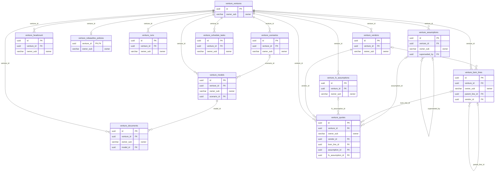

<!-- GENERATED by scripts/generate-schema-docs.js - do not edit by hand; regenerate instead. -->

# Venture Plan (`venture-plan`) - database schema

Postgres database `oshal`, schema `public` - shared with the platform and every other installed package. 13 tables in the reference database.

**Migrations** (declared in `oshal-app.yaml`, applied on activation, recorded in `app_package_migrations`): `migrations/001-venture-core.sql`, `migrations/002-venture-supply-chain.sql`, `migrations/003-venture-outputs.sql`, `migrations/004-venture-fx.sql`, `migrations/005-venture-rebaseline.sql`

**Created at runtime by package code** (`CREATE TABLE IF NOT EXISTS`): `routes/venture-schema.js`, `src-routes/venture-schema.ts`

Platform conventions (ownership, RLS, how migrations run): [core data model](https://github.com/emeraldcoastsystemsgroup/oshal/blob/main/docs/architecture/data-model/README.md).

The diagram shows key columns only: primary keys (PK), foreign keys (FK), single-column unique keys (UK) and the column an RLS policy scopes rows by ("owner"). A box with no columns is a table documented on another page. Every column is listed under Tables.

## Diagram

## Tables

### `venture_assumptions`

Defined in `migrations/001-venture-core.sql`, `routes/venture-schema.js`, `src-routes/venture-schema.ts` · RLS **forced** - owner `owner_sub`

| Column | Type | Null | Default | Notes |
|---|---|---|---|---|
| `id` | uuid | no | gen_random_uuid() | PK |
| `venture_id` | uuid | no |  | FK → [`venture_ventures.id`](#venture_ventures) |
| `owner_sub` | character varying(255) | no |  | owner |
| `key` | character varying(160) | no |  |  |
| `domain` | character varying(24) | no |  |  |
| `label` | text | no |  |  |
| `unit` | character varying(24) | no |  |  |
| `value_num` | numeric(24,6) | yes |  |  |
| `value_text` | text | yes |  |  |
| `low_num` | numeric(24,6) | yes |  |  |
| `high_num` | numeric(24,6) | yes |  |  |
| `source_kind` | character varying(24) | no |  |  |
| `source_detail` | text | yes |  |  |
| `source_url` | text | yes |  |  |
| `confidence` | character varying(12) | no |  |  |
| `authored_by` | character varying(120) | no |  |  |
| `run_id` | uuid | yes |  |  |
| `superseded_by` | uuid | yes |  | FK → [`venture_assumptions.id`](#venture_assumptions) |
| `created_at` | timestamp with time zone | no | now() |  |

### `venture_bom_lines`

Defined in `migrations/002-venture-supply-chain.sql`, `routes/venture-schema.js`, `src-routes/venture-schema.ts` · RLS **forced** - owner `owner_sub`

| Column | Type | Null | Default | Notes |
|---|---|---|---|---|
| `id` | uuid | no | gen_random_uuid() | PK |
| `venture_id` | uuid | no |  | FK → [`venture_ventures.id`](#venture_ventures) |
| `owner_sub` | character varying(255) | no |  | owner |
| `parent_line_id` | uuid | yes |  | FK → [`venture_bom_lines.id`](#venture_bom_lines) |
| `ref` | character varying(32) | no |  |  |
| `part_name` | text | no |  |  |
| `spec_text` | text | yes |  |  |
| `qty_per_unit` | numeric(14,6) | no | 1 |  |
| `uom` | character varying(16) | no | 'ea' |  |
| `discrete` | boolean | no | true |  |
| `material` | text | yes |  |  |
| `process` | text | yes |  |  |
| `make_or_buy` | character varying(8) | no | 'buy' |  |
| `unit_cost_micros` | bigint | yes |  |  |
| `low_micros` | bigint | yes |  |  |
| `high_micros` | bigint | yes |  |  |
| `scrap_pct` | numeric(6,3) | no | 0 |  |
| `moq` | integer | yes |  |  |
| `lead_time_days` | integer | yes |  |  |
| `tooling_cost_micros` | bigint | no | 0 |  |
| `tooling_life_units` | integer | yes |  |  |
| `vendor_id` | uuid | yes |  | FK → [`venture_vendors.id`](#venture_vendors) |
| `assumption_key` | character varying(160) | yes |  |  |
| `hts_code` | character varying(16) | yes |  |  |
| `duty_pct` | numeric(6,3) | yes |  |  |
| `source_kind` | character varying(24) | no | 'model-estimate' |  |
| `confidence` | character varying(12) | no | 'low' |  |
| `sort_order` | integer | no | 0 |  |
| `created_at` | timestamp with time zone | no | now() |  |
| `updated_at` | timestamp with time zone | no | now() |  |

### `venture_documents`

Defined in `migrations/003-venture-outputs.sql`, `routes/venture-schema.js`, `src-routes/venture-schema.ts` · RLS **forced** - owner `owner_sub`

| Column | Type | Null | Default | Notes |
|---|---|---|---|---|
| `id` | uuid | no | gen_random_uuid() | PK |
| `venture_id` | uuid | no |  | FK → [`venture_ventures.id`](#venture_ventures) |
| `owner_sub` | character varying(255) | no |  | owner |
| `doc_key` | character varying(48) | no |  |  |
| `version` | integer | no |  |  |
| `model_id` | uuid | no |  | FK → [`venture_models.id`](#venture_models) |
| `title` | text | no |  |  |
| `body_md` | text | no |  |  |
| `sections` | jsonb | no | '[]' |  |
| `prose_run_id` | uuid | yes |  |  |
| `prose_status` | character varying(12) | no | 'none' |  |
| `unverified_numbers` | jsonb | no | '[]' |  |
| `assumptions_cited` | jsonb | no | '[]' |  |
| `estimate_pct` | numeric(6,3) | no | 100 |  |
| `created_at` | timestamp with time zone | no | now() |  |

### `venture_fx_assumptions`

Defined in `migrations/004-venture-fx.sql`, `routes/venture-schema.js`, `src-routes/venture-schema.ts` · RLS **forced** - owner `owner_sub`

| Column | Type | Null | Default | Notes |
|---|---|---|---|---|
| `id` | uuid | no | gen_random_uuid() | PK |
| `venture_id` | uuid | no |  | FK → [`venture_ventures.id`](#venture_ventures) |
| `owner_sub` | character varying(255) | no |  | owner |
| `source_currency` | character(3) | no |  |  |
| `reporting_currency` | character(3) | no |  |  |
| `rate_nanos` | bigint | no |  |  |
| `source_kind` | character varying(24) | no |  |  |
| `source_ref` | text | no |  |  |
| `observed_at` | timestamp with time zone | no |  |  |
| `idempotency_key` | character varying(128) | no |  |  |
| `authored_by` | character varying(120) | no |  |  |
| `created_at` | timestamp with time zone | no | now() |  |

### `venture_headcount`

Defined in `migrations/002-venture-supply-chain.sql`, `routes/venture-schema.js`, `src-routes/venture-schema.ts` · RLS **forced** - owner `owner_sub`

| Column | Type | Null | Default | Notes |
|---|---|---|---|---|
| `id` | uuid | no | gen_random_uuid() | PK |
| `venture_id` | uuid | no |  | FK → [`venture_ventures.id`](#venture_ventures) |
| `owner_sub` | character varying(255) | no |  | owner |
| `role` | text | no |  |  |
| `kind` | character varying(12) | no | 'employee' |  |
| `fte` | numeric(6,3) | no | 1 |  |
| `start_month` | integer | no | 0 |  |
| `end_month` | integer | yes |  |  |
| `base_salary_micros` | bigint | no | 0 |  |
| `burden_bps` | integer | no | 3000 |  |
| `recruit_cost_micros` | bigint | no | 0 |  |
| `assumption_key` | character varying(160) | yes |  |  |
| `source_kind` | character varying(24) | no | 'model-estimate' |  |
| `confidence` | character varying(12) | no | 'low' |  |
| `sort_order` | integer | no | 0 |  |
| `created_at` | timestamp with time zone | no | now() |  |

### `venture_models`

Defined in `migrations/003-venture-outputs.sql`, `routes/venture-schema.js`, `src-routes/venture-schema.ts` · RLS **forced** - owner `owner_sub`

| Column | Type | Null | Default | Notes |
|---|---|---|---|---|
| `id` | uuid | no | gen_random_uuid() | PK |
| `venture_id` | uuid | no |  | FK → [`venture_ventures.id`](#venture_ventures) |
| `owner_sub` | character varying(255) | no |  | owner |
| `scenario_id` | uuid | yes |  | FK → [`venture_scenarios.id`](#venture_scenarios) |
| `run_id` | uuid | yes |  |  |
| `engine_version` | character varying(16) | no |  |  |
| `inputs_hash` | character(64) | no |  |  |
| `figures` | jsonb | no |  |  |
| `tables` | jsonb | no |  |  |
| `coverage` | jsonb | no |  |  |
| `warnings` | jsonb | no | '[]' |  |
| `posture` | character varying(16) | no | 'estimate' |  |
| `can_publish` | boolean | no | false |  |
| `computed_at` | timestamp with time zone | no | now() |  |

### `venture_quotes`

Defined in `migrations/002-venture-supply-chain.sql`, `routes/venture-schema.js`, `src-routes/venture-schema.ts` · RLS **forced** - owner `owner_sub`

| Column | Type | Null | Default | Notes |
|---|---|---|---|---|
| `id` | uuid | no | gen_random_uuid() | PK |
| `venture_id` | uuid | no |  | FK → [`venture_ventures.id`](#venture_ventures) |
| `owner_sub` | character varying(255) | no |  | owner |
| `vendor_id` | uuid | no |  | FK → [`venture_vendors.id`](#venture_vendors) |
| `bom_line_id` | uuid | yes |  | FK → [`venture_bom_lines.id`](#venture_bom_lines) |
| `qty_break` | integer | no | 1 |  |
| `unit_cost_micros` | bigint | no |  |  |
| `currency` | character(3) | no | 'USD' |  |
| `tooling_cost_micros` | bigint | no | 0 |  |
| `incoterm` | character varying(12) | yes |  |  |
| `lead_time_days` | integer | yes |  |  |
| `valid_until` | date | yes |  |  |
| `document_ref` | text | yes |  |  |
| `notes` | text | yes |  |  |
| `assumption_id` | uuid | yes |  | FK → [`venture_assumptions.id`](#venture_assumptions) |
| `received_at` | timestamp with time zone | no | now() |  |
| `reporting_currency` | character(3) | yes |  |  |
| `reporting_unit_cost_micros` | bigint | yes |  |  |
| `reporting_tooling_cost_micros` | bigint | yes |  |  |
| `fx_assumption_id` | uuid | yes |  | FK → [`venture_fx_assumptions.id`](#venture_fx_assumptions) |

### `venture_rebaseline_policies`

Defined in `migrations/005-venture-rebaseline.sql`, `routes/venture-schema.js`, `src-routes/venture-schema.ts` · RLS **forced** - owner `owner_sub`

| Column | Type | Null | Default | Notes |
|---|---|---|---|---|
| `venture_id` | uuid | no |  | PK · FK → [`venture_ventures.id`](#venture_ventures) |
| `owner_sub` | character varying(255) | no |  | owner |
| `enabled` | boolean | no | false |  |
| `dry_run` | boolean | no | true |  |
| `cadence` | character varying(12) | no | 'weekly' |  |
| `weekly_day` | smallint | no | 1 |  |
| `max_cost_micros` | bigint | no | 0 |  |
| `updated_at` | timestamp with time zone | no | now() |  |

### `venture_runs`

Defined in `migrations/001-venture-core.sql`, `routes/venture-schema.js`, `src-routes/venture-schema.ts` · RLS **forced** - owner `owner_sub`

| Column | Type | Null | Default | Notes |
|---|---|---|---|---|
| `id` | uuid | no | gen_random_uuid() | PK |
| `venture_id` | uuid | no |  | FK → [`venture_ventures.id`](#venture_ventures) |
| `owner_sub` | character varying(255) | no |  | owner |
| `kind` | character varying(16) | no |  |  |
| `status` | character varying(16) | no | 'running' |  |
| `phase` | character varying(24) | yes |  |  |
| `phases` | jsonb | no | '[]' |  |
| `bots_requested` | integer | no | 0 |  |
| `bots_completed` | integer | no | 0 |  |
| `error` | text | yes |  |  |
| `started_at` | timestamp with time zone | no | now() |  |
| `finished_at` | timestamp with time zone | yes |  |  |
| `trigger_kind` | character varying(16) | no | 'manual' |  |
| `schedule_slot` | character varying(32) | yes |  |  |
| `cost_cap_micros` | bigint | yes |  |  |
| `cost_spent_micros` | bigint | no | 0 |  |
| `cost_status` | character varying(24) | no | 'not-capped' |  |

### `venture_scenarios`

Defined in `migrations/001-venture-core.sql`, `routes/venture-schema.js`, `src-routes/venture-schema.ts` · RLS **forced** - owner `owner_sub`

| Column | Type | Null | Default | Notes |
|---|---|---|---|---|
| `id` | uuid | no | gen_random_uuid() | PK |
| `venture_id` | uuid | no |  | FK → [`venture_ventures.id`](#venture_ventures) |
| `owner_sub` | character varying(255) | no |  | owner |
| `name` | text | no |  |  |
| `overrides` | jsonb | no | '{}' |  |
| `volume_units` | integer | yes |  |  |
| `retail_price_cents` | integer | yes |  |  |
| `channel_mix` | jsonb | no | '{}' |  |
| `is_base` | boolean | no | false |  |
| `created_at` | timestamp with time zone | no | now() |  |
| `retail_price_micros` | bigint | yes |  |  |

### `venture_schedule_tasks`

Defined in `migrations/002-venture-supply-chain.sql`, `routes/venture-schema.js`, `src-routes/venture-schema.ts` · RLS **forced** - owner `owner_sub`

| Column | Type | Null | Default | Notes |
|---|---|---|---|---|
| `id` | uuid | no | gen_random_uuid() | PK |
| `venture_id` | uuid | no |  | FK → [`venture_ventures.id`](#venture_ventures) |
| `owner_sub` | character varying(255) | no |  | owner |
| `phase` | character varying(32) | no |  |  |
| `name` | text | no |  |  |
| `owner_role` | text | yes |  |  |
| `duration_days` | integer | no | 1 |  |
| `depends_on` | jsonb | no | '[]' |  |
| `assumption_key` | character varying(160) | yes |  |  |
| `source_kind` | character varying(24) | no | 'model-estimate' |  |
| `confidence` | character varying(12) | no | 'low' |  |
| `sort_order` | integer | no | 0 |  |
| `created_at` | timestamp with time zone | no | now() |  |

### `venture_vendors`

Defined in `migrations/002-venture-supply-chain.sql`, `routes/venture-schema.js`, `src-routes/venture-schema.ts` · RLS **forced** - owner `owner_sub`

| Column | Type | Null | Default | Notes |
|---|---|---|---|---|
| `id` | uuid | no | gen_random_uuid() | PK |
| `venture_id` | uuid | no |  | FK → [`venture_ventures.id`](#venture_ventures) |
| `owner_sub` | character varying(255) | no |  | owner |
| `name` | text | no |  |  |
| `kind` | character varying(24) | no | 'component' |  |
| `country` | character varying(64) | yes |  |  |
| `url` | text | yes |  |  |
| `contact` | text | yes |  |  |
| `moq` | integer | yes |  |  |
| `lead_time_days` | integer | yes |  |  |
| `qualification_days` | integer | yes |  |  |
| `deposit_bps` | integer | no | 0 |  |
| `balance_net_days` | integer | no | 0 |  |
| `qualified` | boolean | no | false |  |
| `notes` | text | yes |  |  |
| `status` | character varying(16) | no | 'candidate' |  |
| `source_kind` | character varying(24) | no | 'model-estimate' |  |
| `confidence` | character varying(12) | no | 'low' |  |
| `created_at` | timestamp with time zone | no | now() |  |
| `updated_at` | timestamp with time zone | no | now() |  |

### `venture_ventures`

Defined in `migrations/001-venture-core.sql`, `routes/venture-schema.js`, `src-routes/venture-schema.ts` · RLS **forced** - owner `owner_sub`

| Column | Type | Null | Default | Notes |
|---|---|---|---|---|
| `id` | uuid | no | gen_random_uuid() | PK |
| `owner_sub` | character varying(255) | no |  | owner |
| `name` | text | no |  |  |
| `idea_text` | text | no |  |  |
| `spec` | jsonb | no | '{}' |  |
| `currency` | character(3) | no | 'USD' |  |
| `target_launch_date` | date | yes |  |  |
| `stage` | character varying(24) | no | 'scoped' |  |
| `horizon_months` | integer | no | 36 |  |
| `open_questions` | jsonb | no | '[]' |  |
| `created_at` | timestamp with time zone | no | now() |  |
| `updated_at` | timestamp with time zone | no | now() |  |
