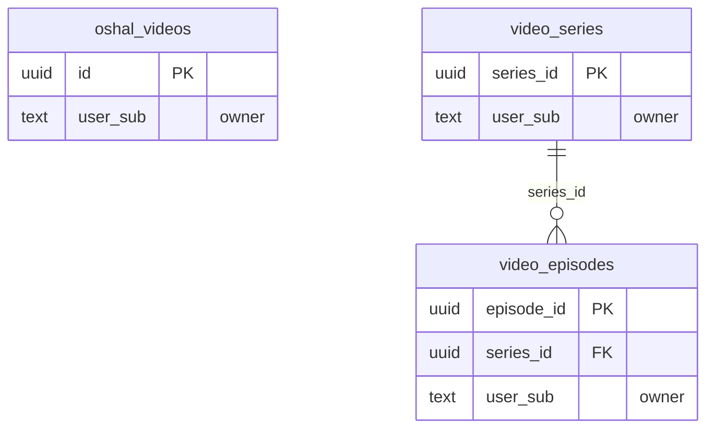

<!-- GENERATED by scripts/generate-schema-docs.js - do not edit by hand; regenerate instead. -->

# Video Studio (`video`) - database schema

Postgres database `oshal`, schema `public` - shared with the platform and every other installed package. 3 tables in the reference database.

**Migrations** (declared in `oshal-app.yaml`, applied on activation, recorded in `app_package_migrations`): `migrations/066-video-series.sql`, `migrations/067-video-episode-scenes.sql`

**Created at runtime by package code** (`CREATE TABLE IF NOT EXISTS`): `routes/video-routes.js`, `src-routes/video-routes.ts`

Platform conventions (ownership, RLS, how migrations run): [core data model](https://github.com/emeraldcoastsystemsgroup/oshal/blob/main/docs/architecture/data-model/README.md).

The diagram shows key columns only: primary keys (PK), foreign keys (FK), single-column unique keys (UK) and the column an RLS policy scopes rows by ("owner"). A box with no columns is a table documented on another page. Every column is listed under Tables.

## Diagram

## Tables

### `oshal_videos`

Defined in `routes/video-routes.js`, `src-routes/video-routes.ts` · RLS **forced** - owner `user_sub`

| Column | Type | Null | Default | Notes |
|---|---|---|---|---|
| `id` | uuid | no | gen_random_uuid() | PK |
| `user_sub` | text | no |  | owner |
| `title` | text | no |  |  |
| `file_name` | text | no |  |  |
| `provider` | text | yes |  |  |
| `download_url` | text | yes |  |  |
| `url` | text | yes |  |  |
| `seconds` | integer | yes |  |  |
| `scenes` | integer | yes |  |  |
| `cost_usd` | numeric(10,2) | yes |  |  |
| `shape` | jsonb | yes |  |  |
| `storyboard` | jsonb | yes |  |  |
| `created_at` | timestamp with time zone | no | now() |  |

### `video_episodes`

Defined in `migrations/066-video-series.sql` · RLS **forced** - owner `user_sub`

Also declared by core (`scripts/migrations/066-video-series.sql`).

| Column | Type | Null | Default | Notes |
|---|---|---|---|---|
| `episode_id` | uuid | no | gen_random_uuid() | PK |
| `series_id` | uuid | no |  | FK → [`video_series.series_id`](#video_series) |
| `user_sub` | text | no |  | owner |
| `ordinal` | integer | no |  |  |
| `title` | text | no |  |  |
| `logline` | text | yes |  |  |
| `script_md` | text | yes |  |  |
| `animation_md` | text | yes |  |  |
| `image_prompts_md` | text | yes |  |  |
| `vids_job_id` | text | yes |  |  |
| `clip_paths` | jsonb | no | '[]' |  |
| `mp4_path` | text | yes |  |  |
| `drive_url` | text | yes |  |  |
| `assembled_path` | text | yes |  |  |
| `status` | text | no | 'planned' |  |
| `error` | text | yes |  |  |
| `created_at` | timestamp with time zone | no | now() |  |
| `updated_at` | timestamp with time zone | no | now() |  |
| `scenes` | jsonb | no | '[]' | Ordered scenes from the screenplay-writer: [{n, camera, motion, dialogue:[{who,line}], reaction}] |
| `frame_ids` | jsonb | no | '[]' | Drive file ids of the storyboard stills, in scene order. The node fetches by id. |

### `video_series`

Defined in `migrations/066-video-series.sql` · RLS **forced** - owner `user_sub`

Also declared by core (`scripts/migrations/066-video-series.sql`).

| Column | Type | Null | Default | Notes |
|---|---|---|---|---|
| `series_id` | uuid | no | gen_random_uuid() | PK |
| `user_sub` | text | no |  | owner |
| `ticket_id` | text | yes |  |  |
| `title` | text | no |  |  |
| `premise` | text | no |  |  |
| `style_lock` | text | yes |  |  |
| `cast_bible` | jsonb | no | '[]' |  |
| `episode_count` | integer | no | 1 |  |
| `scenes_per_episode` | integer | no | 4 |  |
| `orientation` | text | no | 'Landscape' |  |
| `character_image_path` | text | yes |  |  |
| `status` | text | no | 'scripting' |  |
| `error` | text | yes |  |  |
| `created_at` | timestamp with time zone | no | now() |  |
| `updated_at` | timestamp with time zone | no | now() |  |
| `intro_clip` | text | yes |  | Filename of the cached intro clip in the render node's stage dir, prepended to every episode of this series at assembly. NULL = no intro. |
