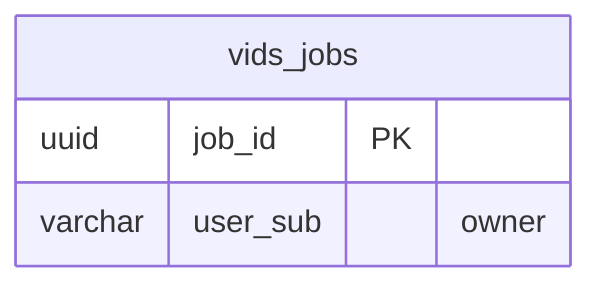

<!-- GENERATED by scripts/generate-schema-docs.js - do not edit by hand; regenerate instead. -->

# Vids Studio (`vids`) - database schema

Postgres database `oshal`, schema `public` - shared with the platform and every other installed package. 1 table in the reference database.

**Migrations** (declared in `oshal-app.yaml`, applied on activation, recorded in `app_package_migrations`): `migrations/059-vids-platform.sql`, `migrations/100-vids-owner-rls.sql`

Platform conventions (ownership, RLS, how migrations run): [core data model](https://github.com/emeraldcoastsystemsgroup/oshal/blob/main/docs/architecture/data-model/README.md).

The diagram shows key columns only: primary keys (PK), foreign keys (FK), single-column unique keys (UK) and the column an RLS policy scopes rows by ("owner"). A box with no columns is a table documented on another page. Every column is listed under Tables.

## Diagram

## Tables

### `vids_jobs`

Defined in `migrations/059-vids-platform.sql` · RLS **forced** - owner `user_sub`

Also declared by core (`scripts/migrations/059-vids-platform.sql`).

| Column | Type | Null | Default | Notes |
|---|---|---|---|---|
| `job_id` | uuid | no | gen_random_uuid() | PK |
| `tenant_id` | uuid | yes |  |  |
| `user_sub` | character varying(255) | no |  | owner |
| `client_id` | character varying(255) | yes |  |  |
| `status` | character varying(20) | no | 'queued' |  |
| `idea` | text | no |  |  |
| `final_prompt` | text | yes |  |  |
| `orientation` | character varying(20) | yes |  |  |
| `insert_mode` | character varying(20) | yes |  |  |
| `ingredient` | text | yes |  |  |
| `outcome` | jsonb | no | '{}' |  |
| `rating` | smallint | yes |  |  |
| `created_at` | timestamp with time zone | no | now() |  |
| `updated_at` | timestamp with time zone | no | now() |  |
